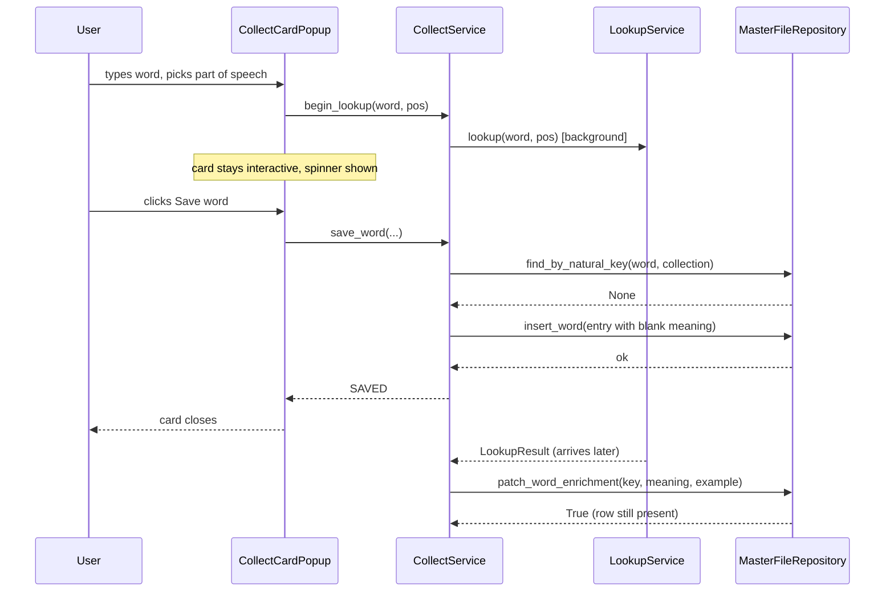
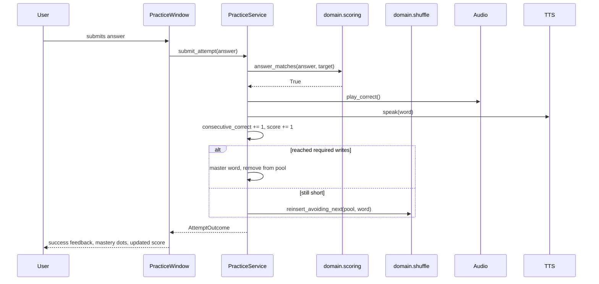
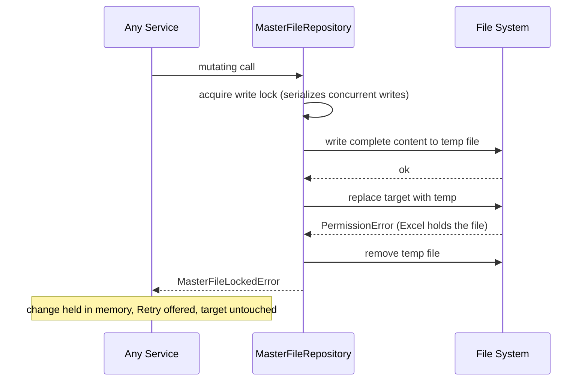

# Component Dependencies — Vocabulary Trainer v2

## Dependency matrix

Rows depend on columns. `X` marks a direct dependency.

| ↓ depends on → | domain | data | integrations | services | ui |
|---|---|---|---|---|---|
| **domain** | internal only | — | — | — | — |
| **data** | X | internal only | — | — | — |
| **integrations** | X | — | internal only | — | — |
| **services** | X | X | X | internal only | — |
| **ui** | X (models only) | — | — | X | internal only |

The upper-right triangle is empty by design. Two consequences worth stating explicitly:

- **Nothing depends on `ui`.** Domain, data, integrations, and services can all be imported and
  tested in a process with no display and no Qt application object. This is NFR-TEST-01 enforced by
  structure rather than by discipline.
- **`ui` never reaches past `services`** except to read domain model types for display. The UI cannot
  call a repository directly, which is what prevents the two UI technologies from each growing their
  own persistence or lookup logic.

---

## Component-level dependency graph

```mermaid
flowchart TD
    subgraph UI["UI LAYER"]
        WidgetWin["FloatingWidgetWindow"]
        MenuPop["WidgetMenuPopup"]
        CollectPop["CollectCardPopup"]
        ConflictPop["DuplicateConflictPopup"]
        Tray["TrayIcon"]
        PracticeWin["PracticeWindow (web)"]
        SettingsWin["SettingsWindow (web)"]
        Theme["Theme tokens"]
    end

    subgraph SVC["SERVICE LAYER"]
        Ctx["AppContext"]
        CollectSvc["CollectService"]
        LookupSvc["LookupService"]
        PracticeSvc["PracticeService"]
        SettingsSvc["SettingsService"]
        WidgetSvc["WidgetStateService"]
    end

    subgraph DATA["DATA LAYER"]
        Repo["MasterFileRepository"]
        Prefs["PreferencesStore"]
        Hist["HistoryStore"]
    end

    subgraph INTEG["INTEGRATION LAYER"]
        FreeDict["FreeDictionaryClient"]
        MW["MerriamWebsterClient"]
        Trans["TranslateClient"]
        TTS["TextToSpeechService"]
        Audio["AudioFeedbackService"]
        Startup["StartupRegistration"]
    end

    subgraph DOM["DOMAIN LAYER"]
        Models["models"]
        NatKey["natural_key"]
        Priority["lookup_priority"]
        Shuffle["shuffle"]
        Scoring["scoring"]
    end

    WidgetWin --> WidgetSvc
    MenuPop --> WidgetSvc
    Tray --> WidgetSvc
    CollectPop --> CollectSvc
    ConflictPop --> CollectSvc
    PracticeWin --> PracticeSvc
    SettingsWin --> SettingsSvc

    Ctx --> CollectSvc
    Ctx --> PracticeSvc
    Ctx --> SettingsSvc
    Ctx --> WidgetSvc

    CollectSvc --> Repo
    CollectSvc --> LookupSvc
    LookupSvc --> FreeDict
    LookupSvc --> MW
    LookupSvc --> Trans
    LookupSvc --> Priority

    PracticeSvc --> Repo
    PracticeSvc --> Hist
    PracticeSvc --> TTS
    PracticeSvc --> Audio
    PracticeSvc --> Shuffle
    PracticeSvc --> Scoring

    SettingsSvc --> Repo
    SettingsSvc --> Prefs
    SettingsSvc --> WidgetSvc
    SettingsSvc --> TTS
    SettingsSvc --> Startup

    WidgetSvc --> Prefs

    Repo --> NatKey
    Repo --> Models
    CollectSvc --> NatKey

    Theme --> WidgetWin
    Theme --> PracticeWin
    Theme --> SettingsWin
```



### Text alternative

```
UI -> SERVICES
  FloatingWidgetWindow, WidgetMenuPopup, TrayIcon -> WidgetStateService
  CollectCardPopup, DuplicateConflictPopup        -> CollectService
  PracticeWindow                                  -> PracticeService
  SettingsWindow                                  -> SettingsService
  AppContext                                      -> all four services

SERVICES -> DATA / INTEGRATIONS / DOMAIN
  CollectService   -> MasterFileRepository, LookupService, natural_key
  LookupService    -> 3 lookup clients, lookup_priority
  PracticeService  -> MasterFileRepository, HistoryStore, TTS, Audio, shuffle, scoring
  SettingsService  -> MasterFileRepository, PreferencesStore, WidgetStateService,
                      TTS, StartupRegistration
  WidgetStateService -> PreferencesStore

DATA -> DOMAIN
  MasterFileRepository -> natural_key, models

Theme tokens feed all three window families.
No arrows point back into UI from any lower layer.
```

---

## Communication patterns

Four patterns are used, each for a specific reason:

| Pattern | Where | Why this one |
|---|---|---|
| **Direct synchronous call** | UI -> services for reads and fast writes; services -> data | Simplest thing that works; the call graph stays readable |
| **Background task + observable handle** | `CollectService.begin_lookup` -> `LookupService` | Lookup must not block the widget (FR-1.9, NFR-PERF-01). The UI holds a handle and reacts when it settles |
| **Observer / subscribe** | `WidgetStateService.subscribe`, `AppContext.on_data_reloaded` | Genuinely one-to-many with no return value: widget state is displayed in three places, and a file reload affects every open view |
| **QWebChannel bridge** | web-rendered views -> Python services | The only way JavaScript reaches Python. Carries data and calls only — never logic |

**Deliberately not used**: a global service locator (hides dependencies, breaks test isolation) and a
general-purpose event bus (would obscure a call graph that is small enough to read directly).

---

## Key data flows

### Collect with concurrent lookup



### Duplicate detected and resolved

```mermaid
sequenceDiagram
    participant U as User
    participant C as CollectCardPopup
    participant D as DuplicateConflictPopup
    participant CS as CollectService
    participant R as MasterFileRepository

    U->>C: clicks Save word
    C->>CS: save_word(...)
    CS->>R: find_by_natural_key(word, collection)
    R-->>CS: existing WordEntry
    CS-->>C: DUPLICATE_DETECTED(existing)
    C->>D: show(existing collection, existing date)
    U->>D: clicks Replace
    D->>CS: resolve_duplicate(REPLACE, existing, incoming)
    CS->>R: replace_word(meaning, example, date)
    R-->>CS: ok
    Note over CS,R: Words and Collection preserved; no new row inserted
```

### Practice attempt



### Atomic write with a locked file



---

## Circular dependency check

No cycles exist. Verified along the paths where one was plausible:

| Potential cycle | Resolution |
|---|---|
| `SettingsService` -> `WidgetStateService` -> back? | No. `WidgetStateService` depends only on `PreferencesStore`. It notifies observers rather than calling back into services |
| `CollectService` -> `LookupService` -> back? | No. `LookupService` depends only on clients and `domain.lookup_priority` |
| UI popups -> services -> UI? | No. Services return values and raise typed errors. Nothing in a service imports a view |
| `MasterFileRepository` -> services? | No. The repository depends only on domain helpers |
| `domain.*` -> anything above it? | No. The domain layer imports nothing from the other four layers |

---

## Testability consequence

Because every arrow points downward, each layer can be tested with the layer below replaced by a
fake:

| Under test | Replace with |
|---|---|
| `domain.*` | nothing — already pure, no test doubles needed |
| `MasterFileRepository` | a real temporary `.xlsx` fixture (NFR-TEST-03) |
| `LookupService` | stub `LookupClient`s returning canned candidates |
| `CollectService`, `PracticeService`, `SettingsService` | in-memory repository fake, stub TTS and audio, fixed clock |
| UI | manual verification — these depend on live Windows compositing and installed voices |

The injected `Clock` matters more than it looks: FR-2.8 stamps rows with the current date, and
FR-6.14 reports elapsed time. Both would otherwise be untestable without sleeping or asserting on
wall-clock values.
