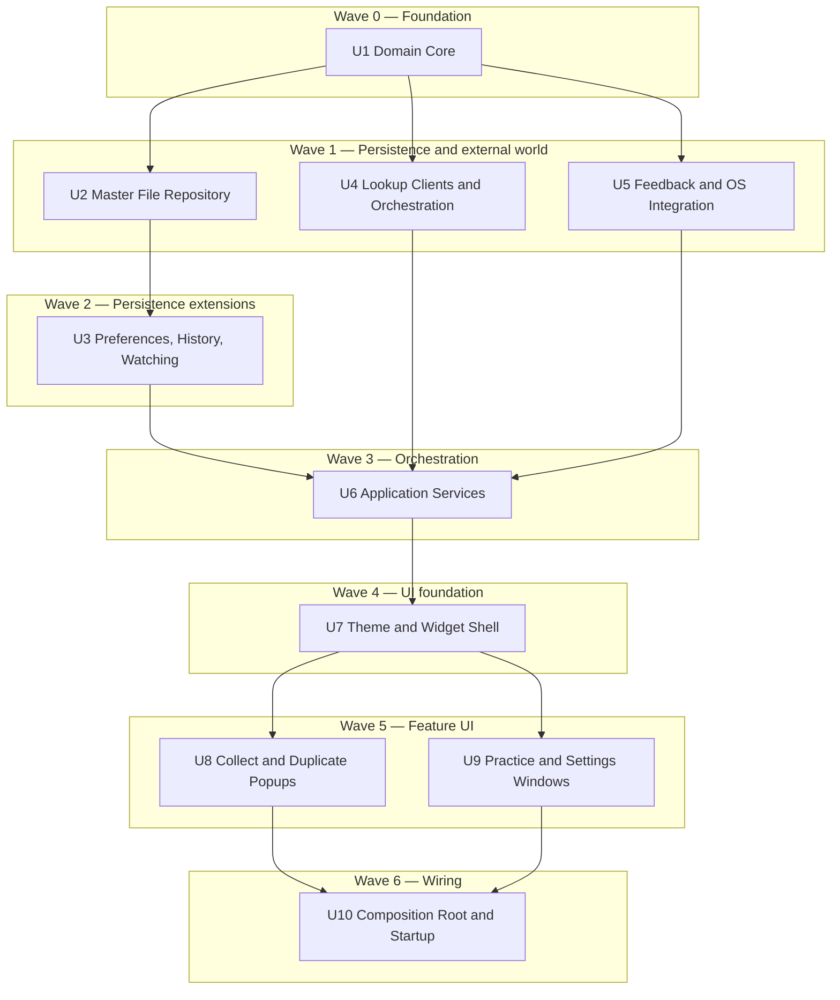

# Unit Dependency Matrix — Vocabulary Trainer v2

## Matrix

Rows depend on columns. `X` = direct dependency.

| ↓ depends on → | U1 | U2 | U3 | U4 | U5 | U6 | U7 | U8 | U9 | U10 |
|---|---|---|---|---|---|---|---|---|---|---|
| **U1** Domain Core | — | | | | | | | | | |
| **U2** Master File Repository | X | — | | | | | | | | |
| **U3** Preferences, History, Watching | X | X | — | | | | | | | |
| **U4** Lookup Clients & Orchestration | X | | | — | | | | | | |
| **U5** Feedback & OS Integration | X | | | | — | | | | | |
| **U6** Application Services | X | X | X | X | X | — | | | | |
| **U7** Theme & Widget Shell | X | | | | | X | — | | | |
| **U8** Collect & Duplicate Popups | X | | | | | X | X | — | | |
| **U9** Practice & Settings Windows | X | | | | | X | X | | — | |
| **U10** Composition Root & Startup | X | X | X | X | X | X | X | X | X | — |

The lower-left triangle only. No unit depends on a higher-numbered unit, so the numbering is itself a
valid build order.

**Notes on specific edges**
- **U3 -> U2**: file watching is added to the repository built in U2, so U3 extends it.
- **U4 -> U1 only**: the lookup stack never touches persistence. Saving is the caller's job.
- **U7 -> U6**: the widget shell reads and mutates widget state through `WidgetStateService`, never
  through `PreferencesStore` directly.
- **U8 -> U7** and **U9 -> U7**: both UI units consume the theme tokens generated in U7, and the
  Qt popups in U8 anchor to the widget window U7 provides.
- **U9 does not depend on U8**: the web-rendered windows and the Qt popups are independent surfaces.
  They can be built in either order once U7 exists.
- **U10 -> everything**: by definition, the composition root is the only place that knows the whole
  graph.

---

## Build Waves

Units within a wave have no dependency on each other. In a single-developer project the waves are a
correctness constraint on ordering rather than a parallelization plan, but they do show where the
order is genuinely free.



### Text alternative

```
Wave 0: U1  Domain Core
Wave 1: U2  Master File Repository      (needs U1)
        U4  Lookup Clients & Orchestration (needs U1)
        U5  Feedback & OS Integration   (needs U1)
Wave 2: U3  Preferences, History, Watching (needs U1, U2)
Wave 3: U6  Application Services        (needs U1-U5)
Wave 4: U7  Theme & Widget Shell        (needs U1, U6)
Wave 5: U8  Collect & Duplicate Popups  (needs U1, U6, U7)
        U9  Practice & Settings Windows (needs U1, U6, U7)
Wave 6: U10 Composition Root & Startup  (needs all)
```

---

## Recommended Build Sequence

The numeric order U1 -> U10, with U8 before U9 inside Wave 5.

**Why this order, beyond dependency satisfaction** — it front-loads all three technical risks named in
the execution plan:

| Position | Unit | Risk confronted |
|---|---|---|
| 2nd | U2 | **Risk #3** — atomic writes and locked-file handling, proven against real workbook fixtures before any UI depends on it. This is where data loss would occur |
| 6th | U6 | **Risk #1a** — every service tested with no Qt application object in the process. Proving UI-independence here is what makes both UI technologies safe to add later |
| 7th | U7 | **Risk #2** — the transparent always-on-top overlay, the most platform-sensitive feature. Built before the feature popups so a fundamental problem surfaces while the approach can still change |
| 9th | U9 | **Risk #1b** — the web-rendered half of the hybrid UI, landing on an already-proven service layer and an already-proven theme |

The alternative — building a visible Collect flow first for early feedback — would stack the capture
UI on an unproven persistence layer. Given that the workbook is the system of record and holds
potentially months of collected words, proving persistence first is the better trade.

**Within Wave 5, U8 before U9**: U8 is smaller and shares the Qt mechanism already established in U7,
so it confirms the widget-popup interaction pattern before the larger web-bridge work begins.

---

## Acyclicity Verification

No cycles. Checked along the four paths where one was plausible:

| Candidate cycle | Verdict |
|---|---|
| U2 -> U3 -> U2 | No. U3 extends U2 with watching; U2 has no knowledge of U3 |
| U6 -> U7 -> U6 | No. U7 depends on U6's `WidgetStateService`; no service imports a UI module |
| U7 -> U8 -> U7 | No. U8 anchors to U7's window and consumes its tokens; U7 does not import the popups. U10 wires them together |
| U8 -> U9 | No edge in either direction. Independent surfaces |

Topological sort confirms U1, U2/U4/U5, U3, U6, U7, U8/U9, U10 as a valid order.

---

## Integration Checkpoints

Points where units first meet, and what must be verified when they do:

| After | Checkpoint | Verify |
|---|---|---|
| U3 | Persistence complete | Workbook round-trips both sheets; preferences round-trip; watcher fires after settle, not mid-write |
| U6 | Service layer complete | Every service test passes with no Qt in the process — the UI-independence claim |
| U7 | First UI contact | The widget reads live state from `WidgetStateService` and its position survives a restart |
| U9 | Both UI technologies present | Qt widget and `QWebEngineView` coexist in one event loop with the widget still responsive during a lookup |
| U10 | Full application | Clean start on a fresh machine state, then clean shutdown with no orphaned temp files or threads |

The U9 checkpoint is the one that matters most: it is the first moment both UI technologies run
together, and it is the last point at which the hybrid decision could still be reconsidered cheaply.
