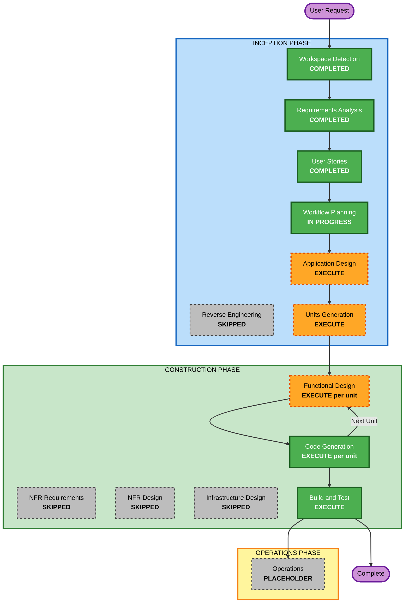

# Execution Plan — Vocabulary Trainer v2

## Detailed Analysis Summary

### Project Nature
- **Type**: Greenfield (v2 built fresh from spec + mockups; all existing code excluded by user
  instruction)
- **Transformation Scope**: Not applicable — no existing system is being transformed. `VocabularyTrainer/`
  v1 remains frozen and untouched alongside the new `VocabularyTrainer.V2/`.

### Change Impact Assessment

| Impact Area | Assessment |
|---|---|
| **User-facing changes** | Yes — the entire product surface is new: floating widget overlay, Collect card, duplicate conflict popup, Practice setup/drill/summary windows, five-tab Settings window, system tray icon |
| **Structural changes** | Yes — a complete application architecture must be defined from nothing: UI layer (two technologies), application services, domain logic, persistence layer |
| **Data model changes** | Yes — the Excel workbook schema (two sheets), the preferences store, and the practice-history store are all new |
| **API changes** | Yes (outbound only) — three external integrations: Free Dictionary API, Merriam-Webster API, Google Translate. No inbound API is exposed |
| **NFR impact** | Yes — concurrency (parallel lookups, serialized writes), data integrity (atomic swaps), responsiveness (non-blocking UI), strict visual fidelity, secret handling for the API key |

### Risk Assessment

| Dimension | Level | Reasoning |
|---|---|---|
| **Risk Level** | **Medium** | Greenfield work in an isolated folder, so nothing existing can break. Elevated above Low by three genuine technical risks, all identified with mitigations |
| **Rollback Complexity** | **Easy** | v2 lives entirely in its own folder. Deleting it restores the workspace exactly; v1 is never touched |
| **Testing Complexity** | **Moderate** | Domain logic is straightforward to unit test. UI layers, the transparent overlay, and TTS need manual verification since they depend on live Windows compositing and installed voices |

**Identified technical risks**:

1. **Hybrid UI integration** (highest) — PySide6 and a WebView2-hosted view must coexist in one
   process and share the same service layer. *Mitigation*: build the domain and service layers with
   zero UI dependencies (NFR-TEST-01), so both UI technologies are thin consumers. Validate the
   two-technology coexistence early rather than at integration time.
2. **Transparent always-on-top overlay** — per-pixel transparency plus click-through behavior plus
   drag is the most platform-sensitive part of the product. *Mitigation*: it is the first UI unit
   built, so a fundamental problem surfaces early while the approach can still change.
3. **Atomic writes against a file the user may hold open** — the locked-file and atomic-swap paths
   are where data loss would actually occur. *Mitigation*: build and test the persistence layer
   first, against real temporary workbook fixtures (NFR-TEST-03).

---

## Workflow Visualization



### Text alternative

```
INCEPTION PHASE
  Workspace Detection ......... COMPLETED
  Reverse Engineering ......... SKIPPED   (greenfield by user instruction)
  Requirements Analysis ....... COMPLETED (74 FRs, 8 epics, comprehensive)
  User Stories ................ COMPLETED (42 stories, 2 personas)
  Workflow Planning ........... IN PROGRESS
  Application Design .......... EXECUTE
  Units Generation ............ EXECUTE

CONSTRUCTION PHASE (per unit, repeating)
  Functional Design ........... EXECUTE for units with domain logic
  NFR Requirements ............ SKIPPED   (tech stack + NFRs already fixed)
  NFR Design .................. SKIPPED   (follows NFR Requirements)
  Infrastructure Design ....... SKIPPED   (local desktop app, no infrastructure)
  Code Generation ............. EXECUTE for every unit
  Build and Test .............. EXECUTE once, after all units

OPERATIONS PHASE
  Operations .................. PLACEHOLDER
```

---

## Phases to Execute

### INCEPTION PHASE

- [x] **Workspace Detection** — COMPLETED
- [x] **Reverse Engineering** — SKIPPED
  - **Rationale**: The user explicitly instructed that v2 be approached fresh with no coding
    reference. Analyzing the v1 codebase would directly violate that constraint.
- [x] **Requirements Analysis** — COMPLETED
- [x] **User Stories** — COMPLETED
- [x] **Workflow Planning** — IN PROGRESS
- [ ] **Application Design** — **EXECUTE**
  - **Rationale**: Every component of this system is new. Nothing exists to design within. The
    hybrid UI decision in particular demands an explicit component boundary showing how PySide6
    views and WebView2-hosted views both consume one shared service layer without duplicating logic
    — get this wrong and the two UI technologies grow divergent copies of the same behavior.
- [ ] **Units Generation** — **EXECUTE**
  - **Rationale**: 42 stories across 8 epics with new data models, three external integrations, and
    two UI technologies is far past what a single unit can carry. Decomposition also establishes the
    build order that lets the three identified technical risks be confronted early.

### CONSTRUCTION PHASE

- [ ] **Functional Design** — **EXECUTE** (per unit, for units carrying domain logic)
  - **Rationale**: Several algorithms have precise, testable specifications that are worth settling
    before code: the natural-key normalization rule, the priority-ordered concurrent lookup
    selection, the atomic write-and-swap sequence, the shuffle with no-immediate-repeat reinsertion,
    and the score/mastery state machine. Skipped for units that are purely presentational.
- [ ] **NFR Requirements** — **SKIP**
  - **Rationale**: This stage exists to determine NFRs and select a tech stack. Both are already
    settled: the full technology stack was decided during Requirements Analysis (Python 3.12+,
    PySide6 + WebView2, pandas + openpyxl), and NFRs are documented across seven categories in
    `requirements.md`. Re-deriving them would produce a duplicate that could drift from the original.
- [ ] **NFR Design** — **SKIP**
  - **Rationale**: Conditional on NFR Requirements executing, which it is not. The NFR patterns that
    matter here — atomic writes, write serialization, background lookups, bounded timeouts — are
    specified as functional requirements and will be designed in Functional Design where they belong.
- [ ] **Infrastructure Design** — **SKIP**
  - **Rationale**: This is a local Windows desktop application. There are no cloud resources, no
    deployment topology, no networking configuration, and no infrastructure-as-code. The only
    "infrastructure" is a local file path and a per-user registry entry for start-with-Windows, both
    already covered by functional requirements.
- [ ] **Code Generation** — **EXECUTE** (always, per unit)
  - **Rationale**: Implementation. Mandatory for every unit, with unit tests generated alongside the
    code they cover and passing before a unit is considered complete.
- [ ] **Build and Test** — **EXECUTE** (always, once after all units)
  - **Rationale**: Full-suite verification, coverage confirmation against the 80% threshold on new
    business logic, and build/test instruction documentation.

### OPERATIONS PHASE

- [ ] **Operations** — PLACEHOLDER
  - **Rationale**: Stage is a placeholder in the workflow. For a locally-installed desktop app there
    is no deployment or monitoring surface to plan.

---

## Additional Deliverable — Outside the AI-DLC Stages

The user's original request included a task that isn't part of any AI-DLC stage, tracked here so it
isn't lost:

- [ ] **Archive the old tasks file and rebuild it fresh**
  - Move `.kiro/specs/vocabulary-trainer/tasks.md` to `.gitignore/archive/`.
  - Rebuild `tasks.md` from the v2 artifacts once Units Generation has established the work
    breakdown, so the new task list reflects v2's units rather than v1's.
  - **Sequencing**: after Units Generation, since the task list derives from the units.
  - **Note**: the destination `.gitignore/archive/` sits inside the `.gitignore/` folder, which the
    workspace steering rule marks as off-limits for reading. Writing an archive there is what was
    asked for and is treated as a move-only operation — the folder's existing contents are not read
    or used.

---

## Estimated Timeline

| Stage | Scope |
|---|---|
| Application Design | 1 pass — component model, service boundaries, hybrid UI integration |
| Units Generation | 1 pass — decomposition and dependency ordering |
| Per-unit Construction | Functional Design (where applicable) + Code Generation, repeated per unit |
| Build and Test | 1 pass across all units |

**Total remaining stages**: 2 INCEPTION + (2 per unit) x N units + 1 Build and Test.

Wall-clock estimates are deliberately omitted — per Q8 the project carries no effort estimates, and
inventing durations here would contradict that decision.

---

## Success Criteria

**Primary goal**: A working Vocabulary Trainer v2 at `VocabularyTrainer.V2/`, built only from
`specs/output_specs.md` and `mockup/`, with v1 left untouched.

**Key deliverables**:
1. Application design and unit decomposition documents.
2. A runnable Python application implementing all 42 user stories.
3. Unit tests covering the domain and service layers, passing, at 80%+ line coverage on new business
   logic.
4. Build and test instruction documents.
5. A rebuilt `tasks.md`, with the v1 version archived.
6. `specs/output_specs.md` updated to reflect the decisions made during this workflow (required by
   the workspace steering rule).

**Quality gates**:
- Every functional requirement traces to at least one implemented, tested unit.
- No unit is complete while its unit tests are missing or failing.
- The UI matches `mockup/` per NFR-UI-01 through NFR-UI-04.
- v1 (`VocabularyTrainer/`) is byte-identical to its state before this workflow began.
- No v2 code references v1, `VastWords/`, or `.gitignore/` content.
