# User Stories — Vocabulary Trainer v2

**Structure**: Epic -> User Story, with stories ordered inside each epic the way a user encounters
them (journey ordering).

**Each story carries**: an "As a / I want / So that" narrative, a **user flow** as numbered steps
with labelled alternate and error branches plus a Mermaid diagram, acceptance criteria as a
verifiable checklist, traceability to requirement IDs and mockup files, a MoSCoW priority, and the
persona it serves.

**Sources**: `aidlc-docs/inception/requirements/requirements.md` (FR IDs) and `mockup/` (UI).
No implementation reference from v1 or any other existing code was used.

**Personas**: **Collector** (capturing a word mid-task) and **Driller** (dedicated practice
session) — see `personas.md`.

**Count**: 42 stories across 8 epics (E1: 5, E2: 4, E3: 5, E4: 4, E5: 4, E6: 6, E7: 8, E8: 6).

---

## Epic E1 — Floating Widget & App Presence

**Goal**: Give the app a persistent, unobtrusive presence on the desktop that is one click from
every mode, and that can be dismissed without becoming unreachable.

**Mockups**: `mockup/widget-idle.html`, `mockup/widget-menu.html`

---

### E1-S1 — See the widget resting on my desktop

**Priority**: Must
**Persona**: Collector

> **As a** Collector,
> **I want** a small character sitting on my desktop above my other windows,
> **so that** capturing a word is always one click away without me hunting for an app.

#### User flow

1. The user launches the application.
2. The app reads its saved preferences and determines the widget's last position and whether the
   widget is enabled.
3. The app draws the widget as a frameless, transparent, always-on-top window at that position,
   showing the **idle** character image (`mockup/widget-idle.html`, `.mini-ani-widget` containing
   `mini_ani_idle_web.png`).
4. The widget sits above other application windows and does not appear in the taskbar or
   Alt-Tab list.
5. The user continues working in other applications; the widget stays visible and does not steal
   focus.

**Branches**

- **2a. First run, no saved position** -> the app places the widget near the bottom-right of the
  primary display, clear of the taskbar (`.pos-br` in the mockup: 28px from the right, 64px from
  the bottom).
- **2b. Widget was previously disabled** -> the widget is not drawn; the app runs with only its
  tray icon (see E1-S4).
- **3a. Saved position is off-screen** (monitor removed or resolution changed) -> the app clamps
  the position back onto the nearest visible display so the widget can never be stranded.
- **5a. A background lookup is running** -> the widget stays fully responsive to hover, click, and
  drag (FR-1.9).

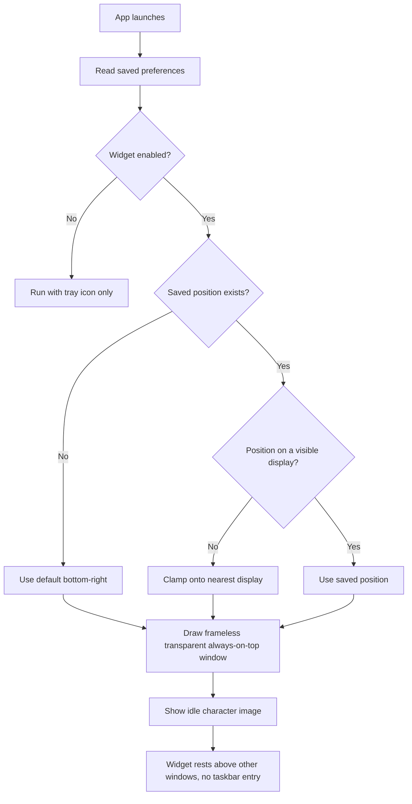
```mermaid
flowchart TD
    Launch["App launches"] --> ReadPrefs["Read saved preferences"]
    ReadPrefs --> EnabledCheck{"Widget enabled?"}
    EnabledCheck -->|"No"| TrayOnly["Run with tray icon only"]
    EnabledCheck -->|"Yes"| PosCheck{"Saved position exists?"}
    PosCheck -->|"No"| DefaultPos["Use default bottom-right"]
    PosCheck -->|"Yes"| OnScreen{"Position on a visible display?"}
    OnScreen -->|"No"| Clamp["Clamp onto nearest display"]
    OnScreen -->|"Yes"| UsePos["Use saved position"]
    DefaultPos --> Draw
    Clamp --> Draw
    UsePos --> Draw["Draw frameless transparent always-on-top window"]
    Draw --> Idle["Show idle character image"]
    Idle --> Rest["Widget rests above other windows, no taskbar entry"]
```

#### Acceptance criteria

- [ ] The widget window has no title bar, no border, and no taskbar entry.
- [ ] The widget renders with per-pixel transparency so the character's edges are soft, not boxed.
- [ ] The widget stays above normal application windows.
- [ ] The widget shows the idle image while at rest.
- [ ] On first run the widget appears near the bottom-right of the primary display, above the
      taskbar.
- [ ] On later runs the widget appears at its last saved position.
- [ ] A saved position that is no longer on any visible display is corrected to a visible one.
- [ ] The widget accepts hover, click, and drag while a dictionary lookup is in progress.
- [ ] The widget does not take keyboard focus from the user's active application when it appears.

**Traceability**: FR-1.1, FR-1.2, FR-1.4, FR-1.9 | `mockup/widget-idle.html`, `mockup/styles.css`
(`.mini-ani-widget`, `.pos-br`, `--shadow-widget`)

---

### E1-S2 — Open the widget menu to choose what to do

**Priority**: Must
**Persona**: Collector, Driller

> **As a** Collector or Driller,
> **I want** clicking the character to show me my options,
> **so that** I can reach Collect, Practice, or Settings without remembering a shortcut.

#### User flow

1. The user clicks the widget.
2. The character switches to its **active** image (`mini_ani_active_web.png`).
3. A popup menu opens anchored beside the widget (`mockup/widget-menu.html`, `.widget-menu` with
   its pointer `::after` triangle aimed at the character), containing in order:
   - **Collect new word** with a blue-tinted icon (`.icon-dot.collect`)
   - **Practice** with a green-tinted icon (`.icon-dot.practice`)
   - a divider (`hr`)
   - **Settings** with a neutral icon (`.icon-dot.settings`)
   - a **Widget on** toggle row (`.toggle-row` containing `.switch`)
4. The user hovers an entry; it highlights with the soft surface background (`.widget-menu
   button:hover`).
5. The user clicks **Collect new word** -> the menu closes and the Collect card opens (E2-S1).
6. The character stays in its active state while the Collect card is open.

**Branches**

- **3a. The widget sits near a screen edge** -> the menu flips to the opposite side so it stays
  fully on screen rather than being clipped.
- **5a. The user clicks Practice** -> the menu closes and the Practice window opens on its setup
  screen (E5-S1).
- **5b. The user clicks Settings** -> the menu closes and the Settings window opens on the General
  tab (E7-S1).
- **5c. The user toggles Widget on -> off** -> the widget hides (E1-S4).
- **5d. The user clicks elsewhere on the desktop** -> the menu closes with no action and the
  character returns to idle.

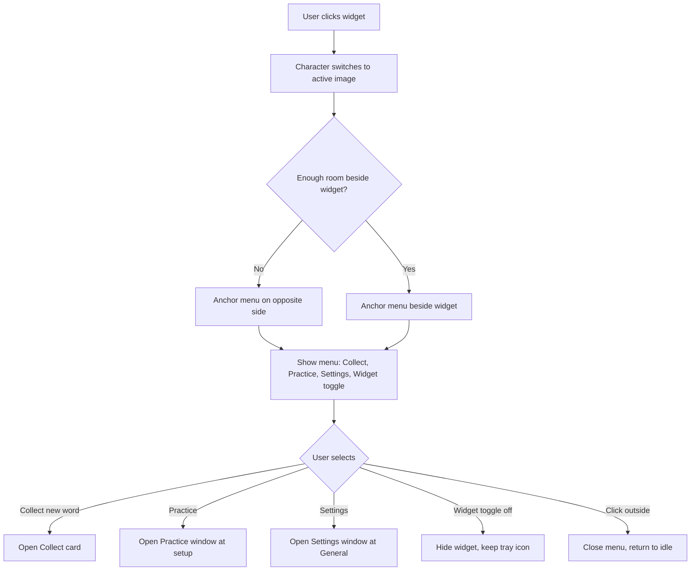
```mermaid
flowchart TD
    Click["User clicks widget"] --> Active["Character switches to active image"]
    Active --> EdgeCheck{"Enough room beside widget?"}
    EdgeCheck -->|"No"| Flip["Anchor menu on opposite side"]
    EdgeCheck -->|"Yes"| Normal["Anchor menu beside widget"]
    Flip --> Show
    Normal --> Show["Show menu: Collect, Practice, Settings, Widget toggle"]
    Show --> Choice{"User selects"}
    Choice -->|"Collect new word"| Collect["Open Collect card"]
    Choice -->|"Practice"| Practice["Open Practice window at setup"]
    Choice -->|"Settings"| Settings["Open Settings window at General"]
    Choice -->|"Widget toggle off"| Hide["Hide widget, keep tray icon"]
    Choice -->|"Click outside"| Dismiss["Close menu, return to idle"]
```

#### Acceptance criteria

- [ ] Clicking the widget opens the menu; the character changes to its active image.
- [ ] The menu lists Collect new word, Practice, a divider, Settings, and a widget on/off toggle,
      in that order.
- [ ] Each action entry shows its coloured icon tint per the mockup.
- [ ] Hovering an entry highlights it.
- [ ] The menu is anchored to the widget and never renders partly off screen.
- [ ] Collect new word opens the Collect card.
- [ ] Practice opens the Practice window on its setup screen.
- [ ] Settings opens the Settings window.
- [ ] Clicking outside the menu closes it without performing an action and returns the character
      to idle.
- [ ] The character remains in its active state for as long as a popup it owns is open.

**Traceability**: FR-1.2, FR-1.5 | `mockup/widget-menu.html`, `mockup/styles.css` (`.widget-menu`,
`.icon-dot`, `.toggle-row`)

---

### E1-S3 — Move the widget out of my way

**Priority**: Must
**Persona**: Collector, Driller

> **As a** user,
> **I want** to drag the character anywhere on screen and have it stay there,
> **so that** it never sits on top of something I need to see.

#### User flow

1. The user presses and holds the mouse button on the widget.
2. The widget enters drag mode; the cursor indicates dragging (`cursor: grab` in the mockup).
3. The user moves the mouse; the widget follows continuously without lag or snapping.
4. The user releases the mouse button.
5. The widget's new position is saved to preferences.
6. On the next app launch the widget appears at that position (links to E1-S1 step 3).

**Branches**

- **3a. The user drags partly beyond a screen edge** -> the widget is constrained so a grabbable
  portion always remains on screen.
- **3b. Multiple monitors** -> the widget can be dragged onto any connected display and its
  position is saved relative to that display.
- **4a. The press was a click, not a drag** (no movement beyond a small threshold) -> no position
  change is saved and the menu opens instead (E1-S2).
- **5a. Saving preferences fails** (disk full, permissions) -> the widget stays where the user
  dropped it for this session; the failure is logged and does not interrupt the user.

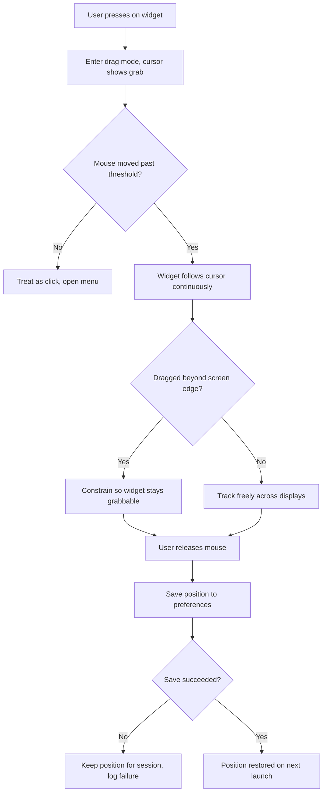
```mermaid
flowchart TD
    Press["User presses on widget"] --> DragMode["Enter drag mode, cursor shows grab"]
    DragMode --> Move{"Mouse moved past threshold?"}
    Move -->|"No"| WasClick["Treat as click, open menu"]
    Move -->|"Yes"| Follow["Widget follows cursor continuously"]
    Follow --> Bound{"Dragged beyond screen edge?"}
    Bound -->|"Yes"| Constrain["Constrain so widget stays grabbable"]
    Bound -->|"No"| Free["Track freely across displays"]
    Constrain --> Release
    Free --> Release["User releases mouse"]
    Release --> Save["Save position to preferences"]
    Save --> SaveOk{"Save succeeded?"}
    SaveOk -->|"No"| LogOnly["Keep position for session, log failure"]
    SaveOk -->|"Yes"| Persisted["Position restored on next launch"]
```

#### Acceptance criteria

- [ ] Pressing and dragging the widget moves it continuously with the cursor.
- [ ] Releasing the drag saves the new position.
- [ ] The saved position is restored on the next app launch.
- [ ] The widget cannot be dragged entirely off screen.
- [ ] The widget can be dropped on any connected display.
- [ ] A press with no meaningful movement is treated as a click and opens the menu instead of
      saving a position.
- [ ] A failure to save the position does not interrupt the user or crash the app.

**Traceability**: FR-1.3, FR-1.4 | `mockup/widget-idle.html` (`.mini-ani-widget`, `cursor: grab`,
`.drag-hint`)

---

### E1-S4 — Hide the widget without losing the app

**Priority**: Must
**Persona**: Driller (hiding), Collector (restoring)

> **As a** Driller who wants a clean screen while working,
> **I want** to turn the character off and still reach the app from the system tray,
> **so that** dismissing it is never a one-way door.

#### User flow

1. The user opens the widget menu (E1-S2) or the Settings Widget tab (E7-S3).
2. The user switches the **Widget on** toggle off.
3. The widget hides immediately.
4. The tray icon remains in the notification area.
5. The preference is saved, so the widget stays hidden across restarts.
6. Later, the user right-clicks the tray icon and gets the same entries as the widget menu:
   Collect, Practice, Settings, and the widget toggle.
7. The user switches the widget back on; it reappears at its last saved position.

**Branches**

- **3a. A Collect card or menu is open when the toggle is switched off** -> that popup closes with
  it, and any unsaved word entry is discarded without being written.
- **4a. The tray icon cannot be created** (shell unavailable) -> the widget is not allowed to hide,
  and the user is told why, so the app can never become unreachable.
- **6a. The user left-clicks the tray icon instead** -> the same menu opens, matching the widget's
  click behavior.
- **7a. The saved position is now off-screen** -> the position is clamped as in E1-S1 branch 3a.

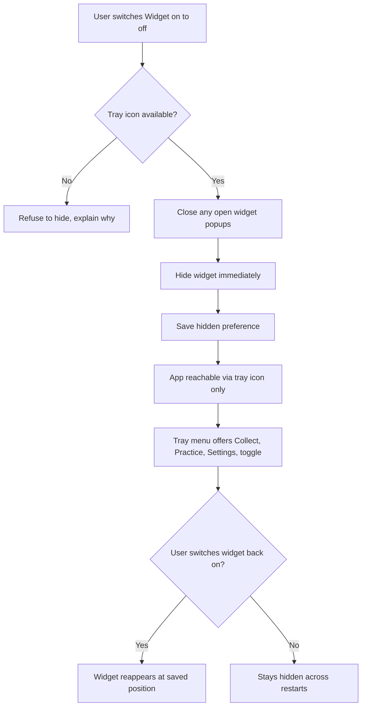
```mermaid
flowchart TD
    Toggle["User switches Widget on to off"] --> TrayCheck{"Tray icon available?"}
    TrayCheck -->|"No"| Refuse["Refuse to hide, explain why"]
    TrayCheck -->|"Yes"| ClosePopups["Close any open widget popups"]
    ClosePopups --> HideWidget["Hide widget immediately"]
    HideWidget --> Persist["Save hidden preference"]
    Persist --> TrayOnly["App reachable via tray icon only"]
    TrayOnly --> TrayMenu["Tray menu offers Collect, Practice, Settings, toggle"]
    TrayMenu --> Restore{"User switches widget back on?"}
    Restore -->|"Yes"| Reappear["Widget reappears at saved position"]
    Restore -->|"No"| StayHidden["Stays hidden across restarts"]
```

#### Acceptance criteria

- [ ] Switching the toggle off hides the widget immediately.
- [ ] The hidden state persists across app restarts.
- [ ] A tray icon is present whenever the app is running, whether or not the widget is shown.
- [ ] The tray menu offers the same entries as the widget menu.
- [ ] Switching the toggle back on restores the widget at its last saved position.
- [ ] The same toggle exists in the widget menu and in Settings, and the two stay in sync.
- [ ] Hiding the widget while a Collect card is open discards that entry rather than saving it.
- [ ] The app never reaches a state where it is running but unreachable.

**Traceability**: FR-1.6, FR-1.7 | `mockup/widget-menu.html` (`.toggle-row`),
`mockup/settings-general.html` (Show widget row)

---

### E1-S5 — Have the app ready when I log in

**Priority**: Should
**Persona**: Collector

> **As a** Collector who captures words throughout the day,
> **I want** the app to start with Windows if I choose,
> **so that** the widget is there without me launching it each morning.

#### User flow

1. The user opens Settings -> General.
2. The user sees a **Start with Windows** toggle, off by default.
3. The user switches it on.
4. The app registers a per-user startup entry.
5. On the next Windows sign-in, the app starts and the widget appears per E1-S1.
6. The user can switch the toggle off, which removes the startup entry.

**Branches**

- **4a. Registering the startup entry fails** (permissions, policy) -> the toggle reverts to off
  and the user is told it could not be registered, rather than showing on while doing nothing.
- **5a. The widget was disabled** -> the app still starts, with the tray icon only.

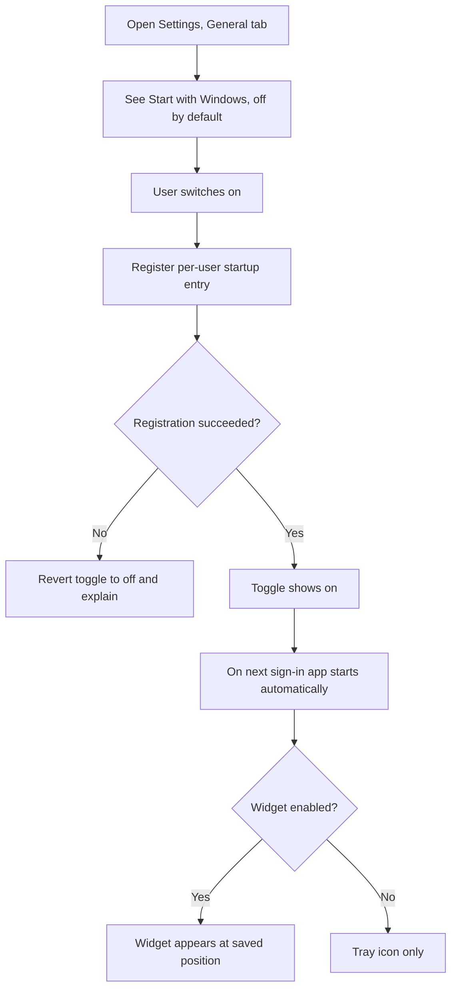
```mermaid
flowchart TD
    OpenGeneral["Open Settings, General tab"] --> SeeToggle["See Start with Windows, off by default"]
    SeeToggle --> SwitchOn["User switches on"]
    SwitchOn --> Register["Register per-user startup entry"]
    Register --> RegOk{"Registration succeeded?"}
    RegOk -->|"No"| Revert["Revert toggle to off and explain"]
    RegOk -->|"Yes"| Saved["Toggle shows on"]
    Saved --> NextLogin["On next sign-in app starts automatically"]
    NextLogin --> WidgetState{"Widget enabled?"}
    WidgetState -->|"Yes"| ShowWidget["Widget appears at saved position"]
    WidgetState -->|"No"| TrayOnly["Tray icon only"]
```

#### Acceptance criteria

- [ ] The Start with Windows toggle appears on the Settings General tab.
- [ ] It is off by default.
- [ ] Switching it on registers a per-user startup entry.
- [ ] Switching it off removes that entry.
- [ ] The setting persists across restarts.
- [ ] A failed registration reverts the toggle and reports the problem.

**Traceability**: FR-1.8, FR-7.3 | `mockup/settings-general.html` (General tab layout)

---

## Epic E2 — Collect a Word

**Goal**: Let the user bank a word in seconds without leaving their current task, including
creating a home for it on the spot.

**Mockups**: `mockup/widget-collect.html`, `mockup/widget-collect-filled.html`

---

### E2-S1 — Enter a word and its part of speech

**Priority**: Must
**Persona**: Collector

> **As a** Collector,
> **I want** a small form for the word and its type,
> **so that** I can record what I just encountered with almost no typing.

#### User flow

1. The user chooses **Collect new word** from the widget or tray menu.
2. The Collect card opens anchored to the widget (`mockup/widget-collect.html`, `.collect-card`),
   showing a title row reading "Collect a word" with a close affordance (`.close-x`).
3. Keyboard focus lands in the **Word or phrase** input (`.text-input`) so the user can type
   immediately.
4. The user types the word.
5. The user clicks one chip in the **Type** row (`.chip-row` offering noun, verb, adjective,
   adverb, phrase); the chosen chip takes the brand-filled active style (`.chip.active`) and any
   previously chosen chip returns to its resting style.
6. Lookup begins in the background as soon as a word and type are present (E3-S1).
7. The **Save word** button (`.btn-primary`) is enabled.

**Branches**

- **4a. The word field is empty or only whitespace** -> Save stays disabled; no lookup starts.
- **5a. No type is chosen** -> Save stays disabled, since Type is required by the data model.
- **5b. The user changes the chosen type after lookup started** -> the lookup's part-of-speech
  preference is re-evaluated against the new type (E3-S2).
- **2a. The user clicks the close affordance** -> the card closes, the entry is discarded, and the
  character returns to idle.
- **3a. The user presses Escape** -> same as closing.

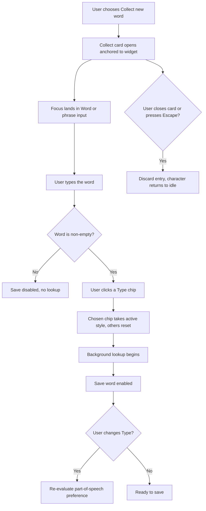
```mermaid
flowchart TD
    Choose["User chooses Collect new word"] --> OpenCard["Collect card opens anchored to widget"]
    OpenCard --> FocusWord["Focus lands in Word or phrase input"]
    FocusWord --> TypeWord["User types the word"]
    TypeWord --> WordValid{"Word is non-empty?"}
    WordValid -->|"No"| SaveOff["Save disabled, no lookup"]
    WordValid -->|"Yes"| PickChip["User clicks a Type chip"]
    PickChip --> ChipSet["Chosen chip takes active style, others reset"]
    ChipSet --> StartLookup["Background lookup begins"]
    StartLookup --> SaveOn["Save word enabled"]
    SaveOn --> ChangeType{"User changes Type?"}
    ChangeType -->|"Yes"| Reeval["Re-evaluate part-of-speech preference"]
    ChangeType -->|"No"| Ready["Ready to save"]
    OpenCard --> Dismiss{"User closes card or presses Escape?"}
    Dismiss -->|"Yes"| Discard["Discard entry, character returns to idle"]
```

#### Acceptance criteria

- [ ] The Collect card opens anchored to the widget with the title "Collect a word" and a close
      affordance.
- [ ] Focus is in the word input when the card opens.
- [ ] The type row offers noun, verb, adjective, adverb, and phrase.
- [ ] Type selection is single-select; choosing one deselects any other.
- [ ] The selected chip is visually distinct from unselected chips.
- [ ] Save is disabled until both a non-whitespace word and a type are present.
- [ ] Closing the card or pressing Escape discards the entry without writing anything.
- [ ] The card does not pre-fill the word from the clipboard or the current text selection.

**Traceability**: FR-2.1, FR-2.2, FR-2.7, FR-2.10 | `mockup/widget-collect.html`,
`mockup/styles.css` (`.collect-card`, `.chip`, `.chip.active`, `.field-label`)

---

### E2-S2 — Choose which collection the word goes into

**Priority**: Must
**Persona**: Collector

> **As a** Collector,
> **I want** to pick the collection the word belongs to,
> **so that** I can practice related words together later.

#### User flow

1. With the Collect card open, the user opens the **Collection** dropdown (`.select-input`).
2. The dropdown lists every existing collection, with **+ New collection…** as its final entry.
3. The user selects an existing collection.
4. The dropdown closes showing that selection, which will be written to the row's
   "Name of collection" column on save.

**Branches**

- **2a. No collections exist yet** -> the default **General** collection is present, because it is
  seeded when the workbook is created (FR-8.1), so there is always a valid destination.
- **3a. The user selects "+ New collection…"** -> the inline creation flow runs (E2-S3).
- **1a. The collection list changed on disk since the card opened** (edited in Excel, or renamed in
  Settings) -> the dropdown reflects the current list, because the app reloads on external change
  (E8-S5).

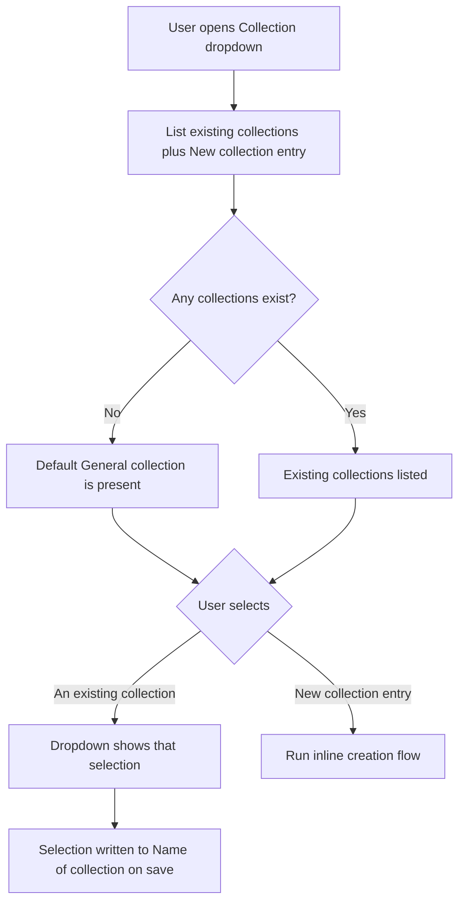
```mermaid
flowchart TD
    OpenDropdown["User opens Collection dropdown"] --> Populate["List existing collections plus New collection entry"]
    Populate --> Empty{"Any collections exist?"}
    Empty -->|"No"| Seeded["Default General collection is present"]
    Empty -->|"Yes"| Listed["Existing collections listed"]
    Seeded --> Select
    Listed --> Select{"User selects"}
    Select -->|"An existing collection"| Chosen["Dropdown shows that selection"]
    Select -->|"New collection entry"| Inline["Run inline creation flow"]
    Chosen --> OnSave["Selection written to Name of collection on save"]
```

#### Acceptance criteria

- [ ] The dropdown lists all existing collections.
- [ ] **+ New collection…** is the last entry in the dropdown.
- [ ] A default **General** collection is always available, even on a brand new workbook.
- [ ] The selected collection is what gets written to the saved row.
- [ ] The list reflects collections created or renamed elsewhere since the card was opened.

**Traceability**: FR-2.3, FR-8.1 | `mockup/widget-collect.html` (`#collection-select`)

---

### E2-S3 — Create a collection without leaving the card

**Priority**: Must
**Persona**: Collector

> **As a** Collector who has just found a word that doesn't fit any existing group,
> **I want** to create a collection right inside the card,
> **so that** I don't have to abandon the capture to go open Settings.

#### User flow

1. The user selects **+ New collection…** from the Collection dropdown.
2. The dropdown and the Save button are hidden, replaced inline by a name text field with
   **Create** and **Cancel** buttons (`mockup/widget-collect.html`, `#new-collection-row`).
3. Focus moves to the name field.
4. The user types a name and clicks **Create**.
5. The name is validated: non-empty, and not matching an existing collection name
   case-insensitively.
6. The collection is created with its creation date set to now.
7. The dropdown and Save button return, with the new collection selected and available for future
   captures.

**Branches**

- **5a. The name is empty or whitespace** -> creation is refused, focus stays in the field, and a
  message explains the name is required.
- **5b. The name matches an existing collection, ignoring case** -> creation is refused with a
  message naming the conflict, rather than silently creating a near-duplicate.
- **6a. Writing the new collection to the workbook fails** (file locked) -> the user is told, the
  inline field stays open with their text intact, and a Retry is offered (E8-S4).
- **4a. The user clicks Cancel** -> the inline field closes, the dropdown and Save button return
  with the previous selection intact, and no collection is created.

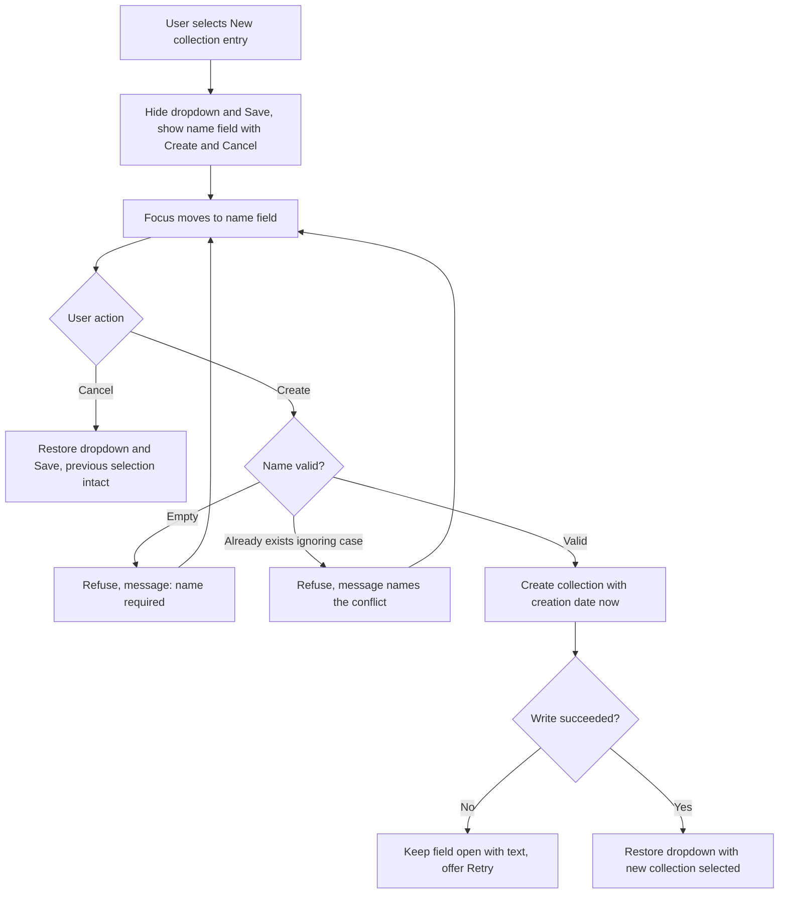
```mermaid
flowchart TD
    PickNew["User selects New collection entry"] --> SwapInline["Hide dropdown and Save, show name field with Create and Cancel"]
    SwapInline --> FocusName["Focus moves to name field"]
    FocusName --> Action{"User action"}
    Action -->|"Cancel"| Restore["Restore dropdown and Save, previous selection intact"]
    Action -->|"Create"| Validate{"Name valid?"}
    Validate -->|"Empty"| ErrEmpty["Refuse, message: name required"]
    Validate -->|"Already exists ignoring case"| ErrDup["Refuse, message names the conflict"]
    Validate -->|"Valid"| Write["Create collection with creation date now"]
    Write --> WriteOk{"Write succeeded?"}
    WriteOk -->|"No"| Locked["Keep field open with text, offer Retry"]
    WriteOk -->|"Yes"| Done["Restore dropdown with new collection selected"]
    ErrEmpty --> FocusName
    ErrDup --> FocusName
```

#### Acceptance criteria

- [ ] Selecting **+ New collection…** replaces the dropdown and Save button with a name field plus
      Create and Cancel.
- [ ] Focus moves to the name field.
- [ ] An empty or whitespace-only name is refused with a visible message.
- [ ] A name matching an existing collection, compared case-insensitively, is refused with a
      visible message.
- [ ] A valid name creates the collection with its creation date set to the current date.
- [ ] After creation the dropdown returns with the new collection selected.
- [ ] The new collection is available in future Collect actions and in Practice setup.
- [ ] Cancel restores the dropdown with the prior selection and creates nothing.
- [ ] The user never has to leave the card to create a collection.

**Traceability**: FR-2.4, FR-2.5, FR-2.6 | `mockup/widget-collect.html`
(`#new-collection-row`, `createCollection()`, `cancelNewCollection()`)

---

### E2-S4 — Save the word immediately, even mid-lookup

**Priority**: Must
**Persona**: Collector

> **As a** Collector on a slow connection,
> **I want** to save the moment I've typed the word,
> **so that** a slow dictionary never costs me the capture.

#### User flow

1. The user has entered a word, chosen a type, and picked a collection.
2. The user clicks **Save word** while the lookup is still running.
3. The app checks for a duplicate by natural key — the word plus the collection, compared
   case-insensitively and whitespace-trimmed.
4. No duplicate is found, so the app writes a new row immediately with the word, type, collection,
   and today's date, leaving Meaning and Example blank.
5. The card confirms the save and closes; the character returns to idle.
6. The lookup finishes afterward and the app patches Meaning and Example onto that same row —
   never inserting a second row.

**Branches**

- **3a. A duplicate is found** -> the conflict popup opens instead of writing (E4-S1).
- **4a. The write fails because the file is locked** -> the pending word is held in memory, the user
  is told to close Excel, and Retry is offered (E8-S4).
- **6a. The lookup had already finished before the save** -> Meaning and Example are written with
  the row in step 4, and no patch is needed.
- **6b. All lookup sources fail** -> the row keeps its blank Meaning and Example; nothing further
  is written (E3-S4).
- **6c. The row was deleted between save and patch** (user removed the collection in Settings) ->
  the patch is abandoned quietly rather than recreating the row.

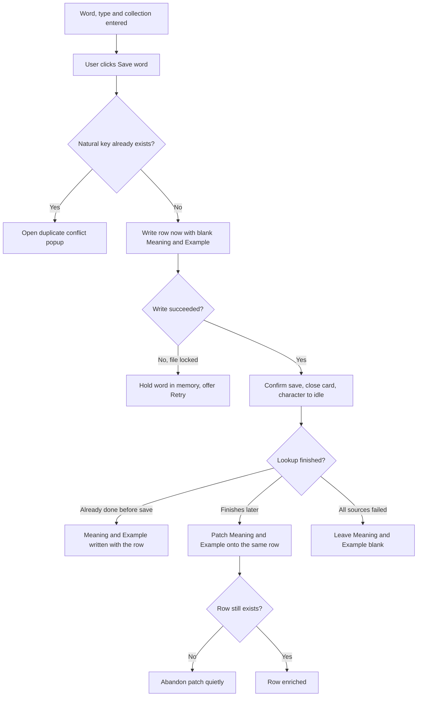
```mermaid
flowchart TD
    Filled["Word, type and collection entered"] --> ClickSave["User clicks Save word"]
    ClickSave --> DupCheck{"Natural key already exists?"}
    DupCheck -->|"Yes"| Conflict["Open duplicate conflict popup"]
    DupCheck -->|"No"| Write["Write row now with blank Meaning and Example"]
    Write --> WriteOk{"Write succeeded?"}
    WriteOk -->|"No, file locked"| Hold["Hold word in memory, offer Retry"]
    WriteOk -->|"Yes"| Confirm["Confirm save, close card, character to idle"]
    Confirm --> LookupState{"Lookup finished?"}
    LookupState -->|"Already done before save"| Included["Meaning and Example written with the row"]
    LookupState -->|"Finishes later"| Patch["Patch Meaning and Example onto the same row"]
    LookupState -->|"All sources failed"| LeaveBlank["Leave Meaning and Example blank"]
    Patch --> RowGone{"Row still exists?"}
    RowGone -->|"No"| Abandon["Abandon patch quietly"]
    RowGone -->|"Yes"| Patched["Row enriched"]
```

#### Acceptance criteria

- [ ] Save is enabled as soon as a word and type are present, regardless of lookup state.
- [ ] Saving mid-lookup writes the row immediately with Meaning and Example blank.
- [ ] The row records the word, type, selected collection, and the current date.
- [ ] When the lookup later completes, the same row is patched rather than a second row inserted.
- [ ] A lookup that completes before the save has its results included in the initial write.
- [ ] A save that finds a duplicate opens the conflict popup and writes nothing.
- [ ] A failed write does not lose the user's entry.
- [ ] A patch whose target row no longer exists does not recreate it.

**Traceability**: FR-2.7, FR-2.8, FR-2.9, FR-8.9 | `mockup/widget-collect.html`
(`#save-btn`, `.status-line`)

---

## Epic E3 — Dictionary Lookup & Enrichment

**Goal**: Fill in meaning and example automatically, from whichever source can answer, without ever
making the user wait.

**Mockups**: `mockup/widget-collect.html` (pending state), `mockup/widget-collect-filled.html`
(resolved state)

> **Note on mockup copy**: both mockups' status text reads "Cambridge Dictionary". Cambridge was
> dropped from the product before v2 and must not be reproduced (NFR-UI-03). The status line names
> the actual source used.

---

### E3-S1 — Get a definition looked up automatically

**Priority**: Must
**Persona**: Collector

> **As a** Collector,
> **I want** the app to find the meaning and an example for me,
> **so that** I don't break off to search a dictionary myself.

#### User flow

1. The user has entered a word and chosen a type in the Collect card.
2. The app starts all three lookups **concurrently** on background threads: the Free Dictionary API,
   the Merriam-Webster API, and Google Translate (EN to Vietnamese).
3. The card shows a spinner and in-progress text (`mockup/widget-collect.html`, `.status-line`
   with `.spinner`).
4. The widget and card stay fully interactive throughout — the user can keep typing, change the
   type, change the collection, or save.
5. Results arrive and the app selects which to keep by priority: Free Dictionary, then
   Merriam-Webster, then Google Translate.
6. The chosen Meaning and Example are shown read-only in a tinted panel inside the card
   (`mockup/widget-collect-filled.html`).
7. The status line turns success-coloured and names the source that produced the result.

**Branches**

- **2a. No Merriam-Webster API key is configured** -> that source is skipped; the other two still
  run (E3-S5).
- **2b. The machine is offline** -> all three fail fast rather than hanging; the flow goes to E3-S4.
- **5a. Only a lower-priority source answered** -> that result is used; priority only decides between
  results that actually arrived.
- **5b. A source exceeds its timeout** -> it is treated as no answer, and the remaining results are
  used rather than the whole lookup stalling.
- **6a. The user already saved** -> the result patches the saved row instead of populating the card
  (E2-S4 step 6).

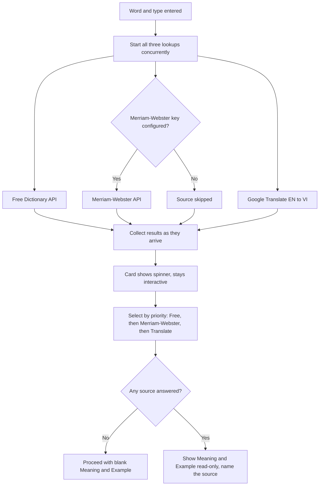
```mermaid
flowchart TD
    Entered["Word and type entered"] --> Fan["Start all three lookups concurrently"]
    Fan --> Free["Free Dictionary API"]
    Fan --> MW{"Merriam-Webster key configured?"}
    Fan --> GT["Google Translate EN to VI"]
    MW -->|"No"| Skipped["Source skipped"]
    MW -->|"Yes"| MWCall["Merriam-Webster API"]
    Free --> Collect2["Collect results as they arrive"]
    MWCall --> Collect2
    Skipped --> Collect2
    GT --> Collect2
    Collect2 --> Spinner["Card shows spinner, stays interactive"]
    Spinner --> Priority["Select by priority: Free, then Merriam-Webster, then Translate"]
    Priority --> Any{"Any source answered?"}
    Any -->|"No"| NoResult["Proceed with blank Meaning and Example"]
    Any -->|"Yes"| Show["Show Meaning and Example read-only, name the source"]
```

#### Acceptance criteria

- [ ] All three sources are queried concurrently, not sequentially.
- [ ] Each source has a bounded timeout so one slow source cannot stall the lookup.
- [ ] The card shows a spinner and progress text while lookups are outstanding.
- [ ] The widget and card remain interactive during lookup.
- [ ] When several sources answer, the highest-priority result is kept: Free Dictionary >
      Merriam-Webster > Google Translate.
- [ ] When only a lower-priority source answers, that result is used.
- [ ] The resolved Meaning and Example are displayed read-only before saving.
- [ ] The status line names the source that produced the kept result.
- [ ] Lookups run off the UI thread and never freeze the interface.

**Traceability**: FR-3.1, FR-3.3, FR-3.6, FR-3.7, FR-3.9, NFR-PERF-01, NFR-PERF-03 |
`mockup/widget-collect.html`, `mockup/widget-collect-filled.html`

---

### E3-S2 — Get the definition that matches the part of speech I chose

**Priority**: Must
**Persona**: Collector

> **As a** Collector who marked a word as a verb,
> **I want** the verb definition rather than the noun one,
> **so that** the stored meaning matches how I actually met the word.

#### User flow

1. A dictionary source returns entries, often several, each with its own part of speech.
2. The app looks for an entry whose part of speech matches the type the user selected.
3. A match is found, so its definition and example are used.

**Branches**

- **3a. No entry matches the chosen type** -> the first available definition is used rather than
  returning nothing.
- **1a. The source returns a single entry with no part-of-speech data** -> that entry is used as-is.
- **2a. The user changes the type after results arrived** -> selection is re-evaluated against the
  new type using the results already in hand, without re-querying the network.

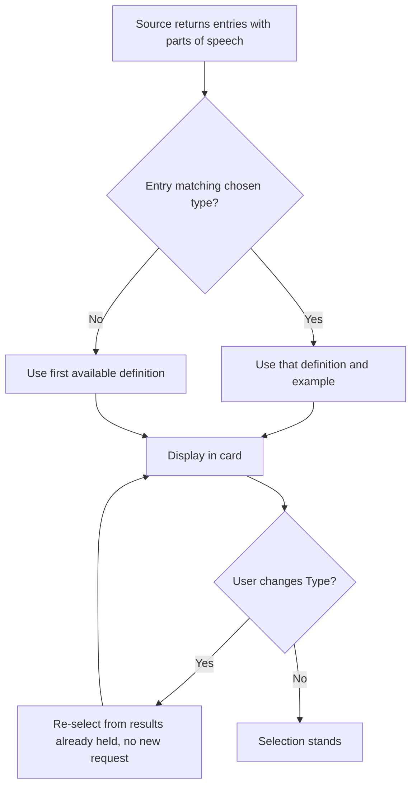
```mermaid
flowchart TD
    Returned["Source returns entries with parts of speech"] --> Match{"Entry matching chosen type?"}
    Match -->|"Yes"| UseMatch["Use that definition and example"]
    Match -->|"No"| UseFirst["Use first available definition"]
    UseMatch --> Display["Display in card"]
    UseFirst --> Display
    Display --> Changed{"User changes Type?"}
    Changed -->|"Yes"| Reselect["Re-select from results already held, no new request"]
    Changed -->|"No"| Final["Selection stands"]
    Reselect --> Display
```

#### Acceptance criteria

- [ ] When a source returns multiple parts of speech, the one matching the user's type is preferred.
- [ ] When no part of speech matches, the first available definition is used rather than none.
- [ ] Entries lacking part-of-speech data are still usable.
- [ ] Changing the type after results arrive re-selects from held results without a new network
      request.
- [ ] The same preference rule is applied to every dictionary source.

**Traceability**: FR-3.2 | `mockup/widget-collect-filled.html` (Meaning and Example panel)

---

### E3-S3 — Fall back to a Vietnamese translation

**Priority**: Must
**Persona**: Collector

> **As a** Vietnamese-speaking Collector,
> **I want** a translation when no English dictionary has the word,
> **so that** obscure words and phrases still get a usable meaning.

#### User flow

1. Neither dictionary source returned a usable entry, but Google Translate did.
2. The Vietnamese translation is stored as the Meaning.
3. The Example is left blank, since a translation carries no example sentence.
4. The status line says the meaning came from translation, so the user can judge its quality.

**Branches**

- **1a. A dictionary source also answered** -> the dictionary result wins on priority and the
  translation is discarded (E3-S1 step 5).
- **1b. Translation also failed** -> flow continues to E3-S4.

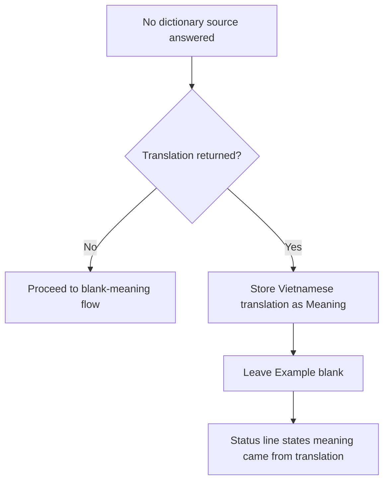
```mermaid
flowchart TD
    NoDict["No dictionary source answered"] --> TransCheck{"Translation returned?"}
    TransCheck -->|"No"| ToBlank["Proceed to blank-meaning flow"]
    TransCheck -->|"Yes"| StoreVi["Store Vietnamese translation as Meaning"]
    StoreVi --> BlankEx["Leave Example blank"]
    BlankEx --> Label["Status line states meaning came from translation"]
```

#### Acceptance criteria

- [ ] When only translation answers, the Vietnamese translation becomes the Meaning.
- [ ] The Example is left blank on a translation result.
- [ ] The status line identifies the result as a translation.
- [ ] A dictionary result always takes precedence over a translation when both are available.

**Traceability**: FR-3.3, FR-3.4, FR-3.6 | `mockup/widget-collect-filled.html`

---

### E3-S4 — Save a word even when every lookup fails

**Priority**: Must
**Persona**: Collector

> **As a** Collector working offline,
> **I want** the word saved anyway,
> **so that** losing my connection never means losing the word.

#### User flow

1. All three sources fail, return nothing, or time out.
2. The app stops trying and does not retry indefinitely.
3. The word is saved with its type, collection, and date; Meaning and Example stay blank.
4. The status line states no definition was found, without presenting it as an error the user must
   resolve.
5. The user can enrich the row later by editing the workbook in Excel.

**Branches**

- **3a. The user already saved before the failures resolved** -> the row simply keeps its blank
  Meaning and Example; nothing is patched.
- **1a. A source fails with a network error rather than "not found"** -> handled identically; the
  user is not shown a stack trace or protocol detail.

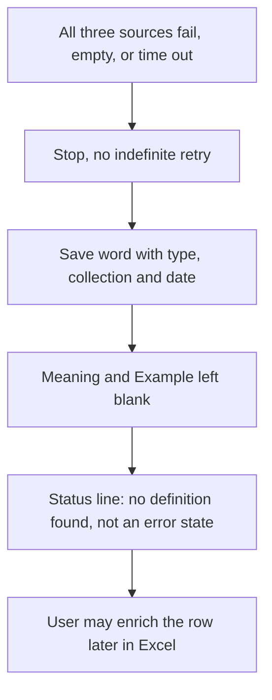
```mermaid
flowchart TD
    AllFail["All three sources fail, empty, or time out"] --> StopTrying["Stop, no indefinite retry"]
    StopTrying --> SaveAnyway["Save word with type, collection and date"]
    SaveAnyway --> BlankBoth["Meaning and Example left blank"]
    BlankBoth --> Inform["Status line: no definition found, not an error state"]
    Inform --> LaterEdit["User may enrich the row later in Excel"]
```

#### Acceptance criteria

- [ ] A word is saved successfully even when all three sources fail.
- [ ] Meaning and Example are blank in that case.
- [ ] The user is informed no definition was found, in non-alarming language.
- [ ] Network failures and "not found" responses are handled the same way from the user's point of
      view.
- [ ] No raw error text, stack trace, or HTTP detail is shown.
- [ ] The app does not retry indefinitely or hang.

**Traceability**: FR-3.5, FR-3.9, NFR-REL-01, NFR-REL-02 | `mockup/widget-collect.html`
(`.status-line`)

---

### E3-S5 — Supply my own Merriam-Webster key

**Priority**: Should
**Persona**: Collector

> **As a** Collector who wants better dictionary coverage,
> **I want** to paste in a Merriam-Webster API key,
> **so that** the second source is available to me — and the app still works if I never add one.

#### User flow

1. The user opens Settings and finds the Merriam-Webster API key field.
2. The user pastes a key and it is saved to local preferences.
3. Subsequent lookups include Merriam-Webster as one of the three concurrent sources.
4. If the field is left empty, Merriam-Webster is skipped and lookups use the other two sources.

**Branches**

- **3a. The key is present but rejected by the service** -> that source is treated as no answer for
  that lookup, and the user is told the key appears invalid rather than the failure being silent.
- **2a. The key is cleared** -> the source reverts to being skipped.

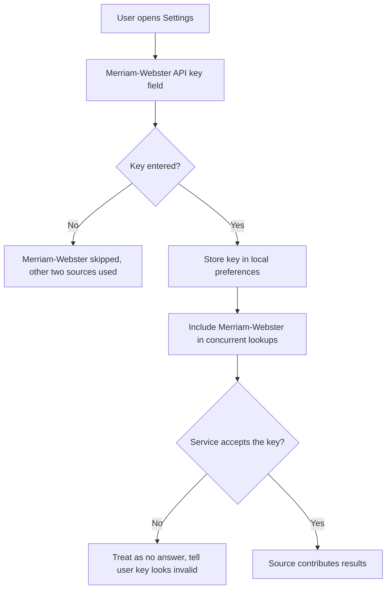
```mermaid
flowchart TD
    OpenSettings["User opens Settings"] --> KeyField["Merriam-Webster API key field"]
    KeyField --> HasKey{"Key entered?"}
    HasKey -->|"No"| Skip["Merriam-Webster skipped, other two sources used"]
    HasKey -->|"Yes"| Store["Store key in local preferences"]
    Store --> Include["Include Merriam-Webster in concurrent lookups"]
    Include --> Valid{"Service accepts the key?"}
    Valid -->|"No"| Invalid["Treat as no answer, tell user key looks invalid"]
    Valid -->|"Yes"| Works["Source contributes results"]
```

#### Acceptance criteria

- [ ] A Merriam-Webster API key can be entered and saved in Settings.
- [ ] The key persists across restarts.
- [ ] With no key configured, Merriam-Webster is skipped and the other two sources are used.
- [ ] With a key configured, Merriam-Webster participates in lookups.
- [ ] A rejected key is reported to the user rather than failing silently.
- [ ] The key is never written to logs or shown in error messages.

**Traceability**: FR-3.8, FR-7.13, NFR-SEC-01 | `mockup/settings-general.html` (settings row
pattern)

---

## Epic E4 — Duplicate Detection & Resolution

**Goal**: When a word is already recorded, show the user what exists and let them decide, with a
safe default if they walk away.

**Mockups**: `mockup/widget-collect-duplicate.html`

---

### E4-S1 — Be told when I've already collected this word

**Priority**: Must
**Persona**: Collector

> **As a** Collector who can't remember everything I've saved,
> **I want** to be shown the existing entry when I collect a word twice,
> **so that** I can decide what to do with enough context to choose quickly.

#### User flow

1. The user clicks **Save word**.
2. The app compares the word and collection against existing rows, ignoring case and surrounding
   whitespace.
3. A match is found, so nothing is written.
4. The Collect card is replaced by the conflict popup (`mockup/widget-collect-duplicate.html`,
   `.conflict-card`) with a warning-coloured border.
5. The popup shows a title naming the word (`.warn-title` with its `!` badge) and a panel
   (`.existing`) stating which collection the entry is in and the date it was collected.
6. Three actions are offered side by side (`.conflict-actions`): **Keep old** (`.btn-outline`),
   **Replace** (`.btn-primary`), and the delete action (`.btn-danger`).
7. A hint line (`.conflict-hint`) states that dismissing the popup keeps the old entry.

**Branches**

- **2a. Same word, different collection** -> not a duplicate, because the natural key is word plus
  collection; the row is written normally.
- **2b. Same word differing only by case or surrounding spaces** -> treated as a duplicate, since
  matching is case-insensitive and trimmed.
- **3a. The lookup was still running when the duplicate was detected** -> the lookup continues, so
  its results are available if the user chooses Replace.

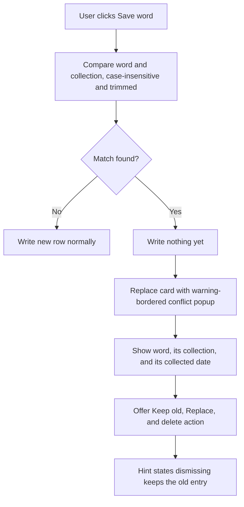
```mermaid
flowchart TD
    Save["User clicks Save word"] --> Compare["Compare word and collection, case-insensitive and trimmed"]
    Compare --> Found{"Match found?"}
    Found -->|"No"| WriteNew["Write new row normally"]
    Found -->|"Yes"| NoWrite["Write nothing yet"]
    NoWrite --> ShowPopup["Replace card with warning-bordered conflict popup"]
    ShowPopup --> ShowContext["Show word, its collection, and its collected date"]
    ShowContext --> Offer["Offer Keep old, Replace, and delete action"]
    Offer --> Hint["Hint states dismissing keeps the old entry"]
```

#### Acceptance criteria

- [ ] Saving a word whose word-plus-collection already exists opens the conflict popup instead of
      writing.
- [ ] The same word in a different collection is not treated as a duplicate.
- [ ] Matching ignores letter case and surrounding whitespace.
- [ ] The popup names the word in its title.
- [ ] The popup shows the existing entry's collection and collected date.
- [ ] All three actions are visible at once, styled per the mockup.
- [ ] The popup states what happens if it is dismissed.
- [ ] Nothing is written to the master file while the popup is open.

**Traceability**: FR-4.1, FR-4.2, FR-8.9 | `mockup/widget-collect-duplicate.html`,
`mockup/styles.css` (`.conflict-card`, `.warn-title`, `.existing`, `.conflict-actions`)

---

### E4-S2 — Keep what I already have

**Priority**: Must
**Persona**: Collector

> **As a** Collector who realises the word is already filed correctly,
> **I want** to keep the existing entry untouched,
> **so that** a duplicate capture costs me nothing.

#### User flow

1. With the conflict popup open, the user clicks **Keep old**.
2. Nothing is written; the existing row keeps its Meaning, Example, and Date exactly as they were.
3. The new submission is discarded.
4. The popup closes and the character returns to idle.

**Branches**

- **1a. The user dismisses the popup instead** — closing it, pressing Escape, or clicking away ->
  the outcome is identical to Keep old, as the hint promised.
- **1b. The widget is toggled off while the popup is open** -> also resolves as Keep old; nothing is
  written.

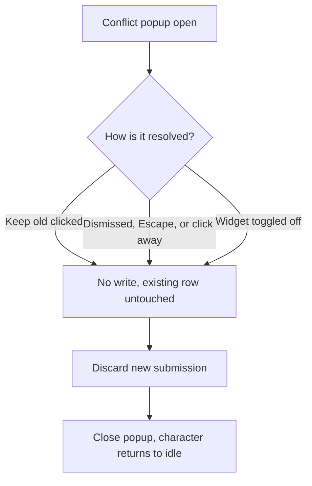
```mermaid
flowchart TD
    PopupOpen["Conflict popup open"] --> Choice{"How is it resolved?"}
    Choice -->|"Keep old clicked"| Keep["No write, existing row untouched"]
    Choice -->|"Dismissed, Escape, or click away"| Keep
    Choice -->|"Widget toggled off"| Keep
    Keep --> DiscardNew["Discard new submission"]
    DiscardNew --> Close["Close popup, character returns to idle"]
```

#### Acceptance criteria

- [ ] Keep old leaves the existing row completely unchanged.
- [ ] The new submission is discarded and never written.
- [ ] Dismissing the popup without choosing behaves identically to Keep old.
- [ ] Pressing Escape behaves identically to Keep old.
- [ ] The master file is not modified at all by this resolution.

**Traceability**: FR-4.3, FR-4.7, FR-4.8 | `mockup/widget-collect-duplicate.html` (`.btn-outline`
"Keep old", `.conflict-hint`)

---

### E4-S3 — Refresh the existing entry with what I just looked up

**Priority**: Must
**Persona**: Collector

> **As a** Collector whose old entry has a poor or missing meaning,
> **I want** to overwrite it with the new lookup,
> **so that** re-collecting a word is a way to improve what I have.

#### User flow

1. With the conflict popup open, the user clicks **Replace**.
2. The existing row's Meaning, Example, and Date are overwritten with the new submission's values.
3. The row's Words and Name of collection are left unchanged, so the word stays where it was.
4. No new row is inserted — the count of rows is unchanged.
5. The popup closes and the character returns to idle.

**Branches**

- **2a. The lookup is still running** -> Replace waits for it, or writes what has arrived and patches
  the rest on completion, consistent with the save-then-patch behavior in E2-S4.
- **2b. All lookups failed** -> Meaning and Example are overwritten with blanks and the Date is
  refreshed. This is a real consequence of Replace, so the popup should not imply the old meaning is
  preserved.
- **2c. The write fails because the file is locked** -> the change is held and Retry is offered
  (E8-S4); the existing row is left intact in the meantime.

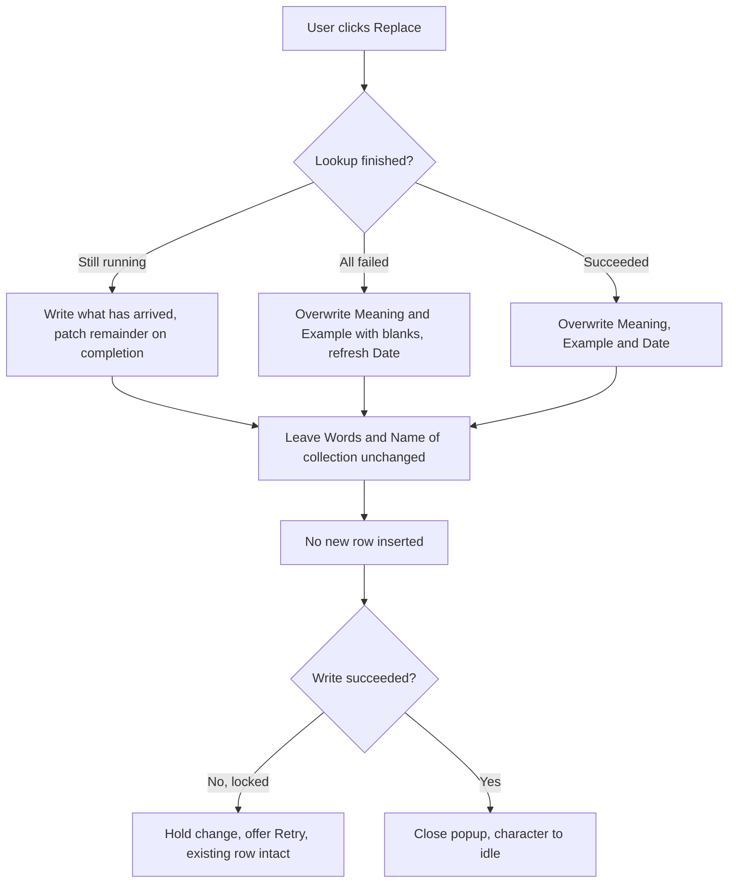
```mermaid
flowchart TD
    ClickReplace["User clicks Replace"] --> LookupState{"Lookup finished?"}
    LookupState -->|"Still running"| WaitPatch["Write what has arrived, patch remainder on completion"]
    LookupState -->|"All failed"| BlankOver["Overwrite Meaning and Example with blanks, refresh Date"]
    LookupState -->|"Succeeded"| Overwrite["Overwrite Meaning, Example and Date"]
    WaitPatch --> Preserve
    BlankOver --> Preserve
    Overwrite --> Preserve["Leave Words and Name of collection unchanged"]
    Preserve --> NoInsert["No new row inserted"]
    NoInsert --> WriteOk{"Write succeeded?"}
    WriteOk -->|"No, locked"| HoldRetry["Hold change, offer Retry, existing row intact"]
    WriteOk -->|"Yes"| Close["Close popup, character to idle"]
```

#### Acceptance criteria

- [ ] Replace overwrites the existing row's Meaning, Example, and Date.
- [ ] Replace leaves the existing row's Words and Name of collection unchanged.
- [ ] No additional row is created; the total row count is unchanged.
- [ ] Replacing when all lookups failed results in blank Meaning and Example and a refreshed Date.
- [ ] A failed write leaves the existing row intact and offers Retry.

**Traceability**: FR-4.4, FR-4.8 | `mockup/widget-collect-duplicate.html` (`.btn-primary`
"Replace")

---

### E4-S4 — Remove the word entirely

**Priority**: Must
**Persona**: Collector

> **As a** Collector who has decided this word isn't worth tracking,
> **I want** one action that removes the old entry and drops my new one,
> **so that** the word is gone from my list without a second cleanup step.

#### User flow

1. The conflict popup shows the delete action with a label that makes its scope unambiguous — for
   example **Delete both** rather than a bare "Delete".
2. The user clicks it.
3. The existing row is removed from the master file.
4. The new submission is discarded and **not** inserted.
5. The popup closes; the word is no longer present in that collection.

**Branches**

- **3a. The write fails because the file is locked** -> nothing is deleted, the user is told, and
  Retry is offered (E8-S4). A partial delete must not occur.
- **2a. The user reconsiders** -> dismissing the popup instead resolves as Keep old (E4-S2), so the
  destructive path always requires a deliberate click.

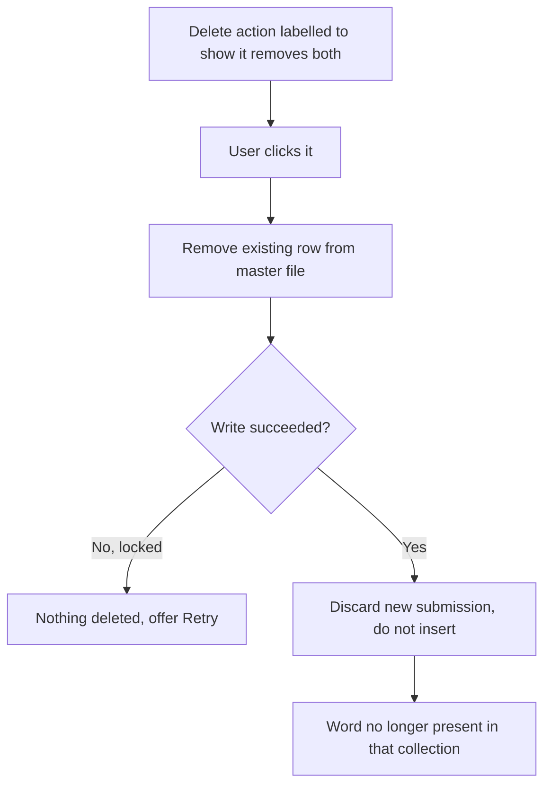
```mermaid
flowchart TD
    Labelled["Delete action labelled to show it removes both"] --> ClickDelete["User clicks it"]
    ClickDelete --> RemoveOld["Remove existing row from master file"]
    RemoveOld --> DelOk{"Write succeeded?"}
    DelOk -->|"No, locked"| NothingDeleted["Nothing deleted, offer Retry"]
    DelOk -->|"Yes"| DropNew["Discard new submission, do not insert"]
    DropNew --> Gone["Word no longer present in that collection"]
```

#### Acceptance criteria

- [ ] The delete action's label makes clear that neither entry survives.
- [ ] Choosing it removes the existing row.
- [ ] Choosing it does not insert the new submission.
- [ ] After the action the word is absent from that collection.
- [ ] A failed write leaves the existing row in place rather than partially deleting.
- [ ] Reaching this outcome always requires an explicit click, never a dismissal.
- [ ] Exactly one of {no change, row updated, row removed} occurs across all three actions, and the
      incoming word is never inserted as a separate row by any of them.

**Traceability**: FR-4.5, FR-4.6, FR-4.8, NFR-REL-03 | `mockup/widget-collect-duplicate.html`
(`.btn-danger`)

---

## Epic E5 — Practice: Session Setup

**Goal**: Let the user assemble exactly the word pool they want to drill, and stop them starting a
session that can't work.

**Mockups**: `mockup/practice-setup.html`

---

### E5-S1 — Open Practice and see my collections

**Priority**: Must
**Persona**: Driller

> **As a** Driller sitting down to study,
> **I want** a window listing my collections with their sizes,
> **so that** I can see what's available to practice.

#### User flow

1. The user chooses **Practice** from the widget or tray menu.
2. A native window opens titled "Vocabulary Trainer — Practice"
   (`mockup/practice-setup.html`, `.native-titlebar`), showing a header with the Practice brand
   mark (`.pw-header`).
3. The body shows the heading "Choose collections" with the explanatory line "Select one or many.
   Word pool combines all selected collections."
4. Every collection is listed as a row (`.collection-item`) showing a checkbox, the collection name,
   its word count, and its creation date.
5. The sort control is reset to **Newest first** each time the window opens.
6. The user reads the list and decides what to practice.

**Branches**

- **4a. No collections exist** -> the seeded **General** collection is shown, with a zero count if
  nothing has been collected yet.
- **4b. Word counts changed since last opened** (words collected, workbook edited in Excel) -> the
  counts shown are current, because data is reloaded on open.
- **2a. The WebView2 runtime is missing** -> a clear, actionable message is shown instead of an
  unhandled failure (NFR-PLAT-02).

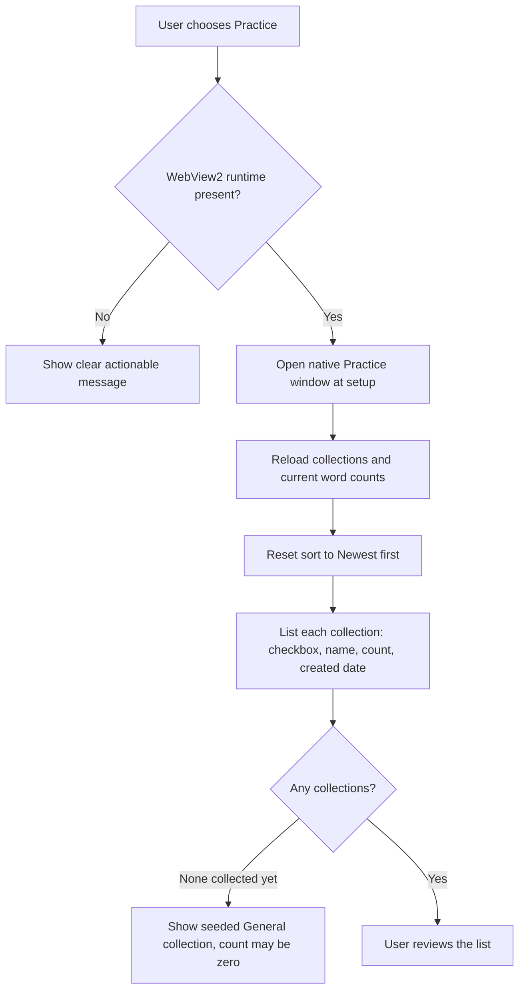
```mermaid
flowchart TD
    ChoosePractice["User chooses Practice"] --> RuntimeCheck{"WebView2 runtime present?"}
    RuntimeCheck -->|"No"| Actionable["Show clear actionable message"]
    RuntimeCheck -->|"Yes"| OpenWindow["Open native Practice window at setup"]
    OpenWindow --> Reload["Reload collections and current word counts"]
    Reload --> ResetSort["Reset sort to Newest first"]
    ResetSort --> ListRows["List each collection: checkbox, name, count, created date"]
    ListRows --> AnyColl{"Any collections?"}
    AnyColl -->|"None collected yet"| ShowGeneral["Show seeded General collection, count may be zero"]
    AnyColl -->|"Yes"| Ready["User reviews the list"]
```

#### Acceptance criteria

- [ ] Choosing Practice opens a native window titled "Vocabulary Trainer — Practice".
- [ ] The setup screen shows the "Choose collections" heading and its explanatory line.
- [ ] Each collection row shows a checkbox, name, word count, and creation date.
- [ ] Word counts reflect the current contents of the master file each time the window opens.
- [ ] The sort mode resets to Newest first whenever the window opens.
- [ ] A workbook with no user-created collections still shows the General collection.
- [ ] A missing WebView2 runtime produces an actionable message, not a crash.

**Traceability**: FR-5.1, FR-5.2, FR-5.5, NFR-PLAT-02 | `mockup/practice-setup.html`,
`mockup/styles.css` (`.native-window`, `.collection-item`, `.pw-header`)

---

### E5-S2 — Find a collection without scrolling

**Priority**: Should
**Persona**: Driller

> **As a** Driller with many collections,
> **I want** to search and sort the list,
> **so that** picking the right ones doesn't mean scanning everything.

#### User flow

1. The user types into the search box above the list (`mockup/practice-setup.html`,
   `#collection-search` with its magnifier glyph).
2. The list filters live on each keystroke, keeping collections whose name contains the typed text,
   compared case-insensitively.
3. The user changes the sort control (`#collection-sort`) between **Newest first**, **Oldest first**,
   and **Name (A–Z)**.
4. The visible rows reorder accordingly.
5. Search and sort compose: sorting reorders whatever the search left visible.

**Branches**

- **2a. No collection matches** -> the message "No collections match your search." is shown in place
  of the list (`#no-results`).
- **2b. The search box is cleared** -> the full list returns in the current sort order.
- **3a. A collection is checked and then filtered out of view** -> it stays checked and still counts
  toward the pool, since filtering is a view concern, not a selection one.
- **4a. Two collections share a creation date** -> ordering between them is stable rather than
  jumping between renders.

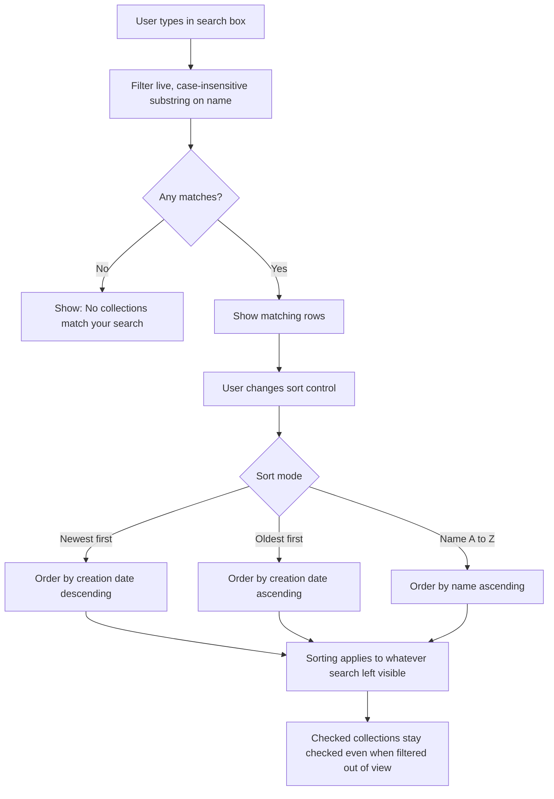
```mermaid
flowchart TD
    TypeSearch["User types in search box"] --> FilterLive["Filter live, case-insensitive substring on name"]
    FilterLive --> Matches{"Any matches?"}
    Matches -->|"No"| NoResults["Show: No collections match your search"]
    Matches -->|"Yes"| ShowSubset["Show matching rows"]
    ShowSubset --> SortChange["User changes sort control"]
    SortChange --> Mode{"Sort mode"}
    Mode -->|"Newest first"| ByNewest["Order by creation date descending"]
    Mode -->|"Oldest first"| ByOldest["Order by creation date ascending"]
    Mode -->|"Name A to Z"| ByName["Order by name ascending"]
    ByNewest --> Compose
    ByOldest --> Compose
    ByName --> Compose["Sorting applies to whatever search left visible"]
    Compose --> KeepChecked["Checked collections stay checked even when filtered out of view"]
```

#### Acceptance criteria

- [ ] Typing in the search box filters the list live.
- [ ] Filtering matches any part of the collection name and ignores case.
- [ ] Zero matches shows "No collections match your search."
- [ ] Clearing the search restores the full list.
- [ ] The sort control offers Newest first, Oldest first, and Name (A–Z).
- [ ] Sorting operates independently of the search filter.
- [ ] Sorting operates independently of which collections are checked.
- [ ] A checked collection that is filtered out of view remains checked and still counts toward the
      pool.
- [ ] Collections sharing a creation date keep a stable relative order.

**Traceability**: FR-5.3, FR-5.4 | `mockup/practice-setup.html` (`#collection-search`,
`#collection-sort`, `#no-results`, `filterCollections()`, `sortCollections()`)

---

### E5-S3 — Build the pool and set my mastery bar

**Priority**: Must
**Persona**: Driller

> **As a** Driller,
> **I want** to combine collections and decide how many correct writes count as mastered,
> **so that** the session matches how hard I want to work.

#### User flow

1. The user checks one or more collections; checked rows take the brand-tinted selected style
   (`.collection-item.selected`).
2. The combined pool size updates and is displayed as, for example, "Pool size: 170 words from 2
   collections".
3. The user adjusts the **Required correct writes** stepper (`.stepper`), which starts at **3**.
4. The value is constrained to 1 through 10; the minus control is disabled at 1 and the plus control
   at 10.
5. The user clicks **Start practice**.
6. The pool is built from every word in the checked collections and shuffled into random order.
7. The drill screen opens (E6-S1).

**Branches**

- **2a. The checked collections contain zero words in total** -> **Start practice** is disabled and a
  message explains why (E5-S4).
- **1a. All collections are unchecked** -> same as 2a; Start is disabled.
- **6a. The pool contains exactly one word** -> the session is valid; reinsertion simply returns that
  word each time (E6-S3 branch).
- **6b. The workbook changed on disk between opening setup and starting** -> the pool is built from
  the current data, since the app reloads on external change (E8-S5).

```mermaid
flowchart TD
    Check["User checks collections"] --> Highlight["Checked rows take selected style"]
    Highlight --> PoolCount["Combined pool size displayed"]
    PoolCount --> Stepper["User adjusts Required correct writes, default 3"]
    Stepper --> Clamp["Constrain 1 to 10, disable controls at bounds"]
    Clamp --> PoolCheck{"Pool has at least one word?"}
    PoolCheck -->|"No"| Disabled["Start disabled with explanation"]
    PoolCheck -->|"Yes"| StartEnabled["Start practice enabled"]
    StartEnabled --> ClickStart["User clicks Start practice"]
    ClickStart --> BuildPool["Gather all words from checked collections"]
    BuildPool --> Shuffle["Shuffle into random order"]
    Shuffle --> OpenDrill["Open drill screen"]
```

#### Acceptance criteria

- [ ] Collections are selected with checkboxes and multiple may be checked.
- [ ] Checked rows are visually distinguished.
- [ ] The combined pool size across checked collections is displayed and updates as checks change.
- [ ] The Required correct writes stepper defaults to 3.
- [ ] The stepper is constrained to 1 through 10 inclusive.
- [ ] The decrement control is disabled at 1 and the increment control at 10.
- [ ] Starting a session builds the pool from all words in the checked collections.
- [ ] The pool is shuffled into random order before the first word is shown.
- [ ] A single-word pool starts a valid session.

**Traceability**: FR-5.6, FR-5.7, FR-5.9 | `mockup/practice-setup.html` (`.setup-row`, `.stepper`,
pool size line)

---

### E5-S4 — Be stopped from starting an empty session

**Priority**: Must
**Persona**: Driller

> **As a** Driller,
> **I want** to be prevented from starting with no words,
> **so that** I don't land in a broken drill screen and have to work out what went wrong.

#### User flow

1. The user's checked collections total zero words — either nothing is checked, or the checked
   collections are all empty.
2. **Start practice** is disabled.
3. A message explains that at least one word is needed and that the checked collections are empty.
4. The user checks a collection containing words.
5. Start becomes enabled immediately.

**Branches**

- **1a. A collection with a zero count is checked** -> permitted as a selection, but it contributes
  nothing to the pool, so Start stays disabled until a non-empty one is also checked.
- **3a. The workbook is empty entirely** (fresh install, nothing collected) -> the message points the
  user toward collecting words first, rather than only stating the pool is empty.

```mermaid
flowchart TD
    Zero["Checked collections total zero words"] --> DisableStart["Disable Start practice"]
    DisableStart --> Explain["Show message explaining a word is required"]
    Explain --> Fresh{"Workbook empty entirely?"}
    Fresh -->|"Yes"| PointToCollect["Message suggests collecting words first"]
    Fresh -->|"No"| PointToSelect["Message notes checked collections are empty"]
    PointToCollect --> UserActs
    PointToSelect --> UserActs["User checks a non-empty collection"]
    UserActs --> EnableStart["Start becomes enabled immediately"]
```

#### Acceptance criteria

- [ ] Start practice is disabled whenever the combined pool is zero words.
- [ ] A message explains why Start is unavailable.
- [ ] Checking a collection that contains words enables Start immediately.
- [ ] Checking only empty collections leaves Start disabled.
- [ ] An entirely empty workbook produces guidance to collect words first.
- [ ] A session can never begin with an empty pool.

**Traceability**: FR-5.8 | `mockup/practice-setup.html` (frame note describing the disabled Start
state)

---

## Epic E6 — Practice: Drill & Summary

**Goal**: Test recall by production, reward correct answers, teach on misses without punishing
progress, and close with a clear read on the session.

**Mockups**: `mockup/practice-drill.html`, `mockup/practice-drill-wrong.html`,
`mockup/practice-summary.html`

---

### E6-S1 — Be prompted to write a word from its meaning

**Priority**: Must
**Persona**: Driller

> **As a** Driller,
> **I want** to see only the type and meaning and type the word myself,
> **so that** I'm practicing recall rather than recognition.

#### User flow

1. The drill screen opens showing the first word from the shuffled pool
   (`mockup/practice-drill.html`).
2. The top bar shows a progress counter and a live **Score** and **Penalties** readout
   (`.drill-topbar`, `.score-pill`), with penalties in the danger colour (`.metric.penalty`).
3A thin progress bar sits under the top bar (`.progress-track` with `.progress-fill`).
4. The stage shows the word's part of speech as a pill badge (`.type-badge`) and its meaning as the
   large prompt (`.meaning`), followed by the instruction "Type the word" (`.hint`).
5. The word's own spelling is **not** shown anywhere on screen.
6. Focus is in the answer input (`.answer-input`), centred and brand-bordered.
7. The user types their answer and submits.

**Branches**

- **4a. The word has no stored Meaning** (all lookups failed when it was collected) -> the prompt
  shows the type badge with an explicit note that no meaning is recorded, so the user isn't staring
  at an empty screen wondering what to type.
- **7a. The user submits an empty answer** -> it is not accepted as a wrong answer; the input simply
  stays focused, so a stray Enter costs nothing.

```mermaid
flowchart TD
    OpenDrill["Drill screen opens with first shuffled word"] --> TopBar["Show progress counter, live Score and Penalties"]
    TopBar --> Bar["Show progress bar"]
    Bar --> Prompt["Show type badge and meaning as prompt"]
    Prompt --> HasMeaning{"Word has a stored meaning?"}
    HasMeaning -->|"No"| NoteMissing["Show type badge with note that no meaning is recorded"]
    HasMeaning -->|"Yes"| ShowMeaning["Show the meaning text"]
    NoteMissing --> Withhold
    ShowMeaning --> Withhold["Word spelling never displayed"]
    Withhold --> FocusInput["Focus in centred answer input"]
    FocusInput --> Submit{"User submits"}
    Submit -->|"Empty answer"| Ignore["Ignore, keep focus, no penalty"]
    Submit -->|"Answer typed"| Judge["Judge the answer"]
```

#### Acceptance criteria

- [ ] The drill screen shows the current word's type as a badge and its meaning as the prompt.
- [ ] The word's spelling is never displayed before an answer is submitted.
- [ ] Score and penalties are visible in the top bar throughout.
- [ ] A progress counter and progress bar are shown.
- [ ] Focus is in the answer input when a word is presented.
- [ ] A word with no stored meaning is presented with an explicit note rather than a blank prompt.
- [ ] Submitting an empty answer is ignored and incurs no penalty.

**Traceability**: FR-6.1, FR-6.2 | `mockup/practice-drill.html`, `mockup/styles.css`
(`.drill-topbar`, `.score-pill`, `.type-badge`, `.meaning`, `.answer-input`)

---

### E6-S2 — Get rewarded for a correct answer

**Priority**: Must
**Persona**: Driller

> **As a** Driller,
> **I want** clear feedback and to hear the word when I get it right,
> **so that** correct spelling and pronunciation reinforce each other.

#### User flow

1. The user submits an answer.
2. The app compares it to the target word, ignoring case and surrounding whitespace.
3. The answer matches, so the app plays a short success sound and reads the word aloud through
   system text-to-speech.
4. Success feedback appears naming the word (`mockup/practice-drill.html`, `.feedback-correct`), and
   the answer input takes the success border and tint.
5. The word's consecutive-correct count increases by one.
6. The mastery dot row (`.mastery-row`) fills one more dot, with one dot per required correct write.
7. A line beneath states progress, for example "2 of 3 correct writes needed — back in the pool".
8. The score increases by one and is reflected in the top bar immediately.

**Branches**

- **3a. No text-to-speech voice is available** -> the success sound still plays and the drill
  continues; the missing voice does not interrupt the session.
- **5a. The count reaches the required number** -> the word is mastered and leaves the pool (E6-S3).
- **5b. The count is still short** -> the word is reinserted into the pool (E6-S3).
- **2a. The answer matches except for case or padding spaces** -> counted as correct, per the
  comparison rule.

```mermaid
flowchart TD
    SubmitAns["User submits an answer"] --> CompareAns["Compare, ignoring case and surrounding whitespace"]
    CompareAns --> IsMatch{"Matches target word?"}
    IsMatch -->|"No"| ToWrong["Go to incorrect-answer flow"]
    IsMatch -->|"Yes"| Sound["Play success sound"]
    Sound --> Speak{"TTS voice available?"}
    Speak -->|"No"| SkipSpeech["Skip speech, continue"]
    Speak -->|"Yes"| ReadAloud["Read the word aloud"]
    SkipSpeech --> Feedback
    ReadAloud --> Feedback["Show success feedback naming the word"]
    Feedback --> Increment["Increase consecutive-correct count by one"]
    Increment --> Dots["Fill one more mastery dot"]
    Dots --> ScoreUp["Score increases, top bar updates immediately"]
    ScoreUp --> Threshold{"Count reached required writes?"}
    Threshold -->|"Yes"| Mastered["Word mastered, leaves pool"]
    Threshold -->|"No"| Reinsert["Word reinserted into pool"]
```

#### Acceptance criteria

- [ ] An answer matching the target word case-insensitively after trimming is judged correct.
- [ ] A correct answer plays a success sound.
- [ ] A correct answer reads the word aloud via system text-to-speech.
- [ ] Success feedback names the word and is styled with the success colour.
- [ ] The word's consecutive-correct count increases by exactly one.
- [ ] The mastery dot row shows one dot per required correct write, filled to the current count.
- [ ] A progress line states how many correct writes remain and whether the word stays in the pool.
- [ ] The score in the top bar updates immediately.
- [ ] An unavailable TTS voice does not interrupt the session.

**Traceability**: FR-6.4, FR-6.5, FR-6.11 | `mockup/practice-drill.html` (`.feedback-correct`,
`.mastery-row`, `.mastery-dot.filled`)

---

### E6-S3 — Keep seeing a word until it sticks

**Priority**: Must
**Persona**: Driller

> **As a** Driller,
> **I want** words I haven't mastered to come back later in the session,
> **so that** repetition does the teaching rather than a single pass.

#### User flow

1. A word's consecutive-correct count is checked against the session's required correct writes.
2. The count is short of the requirement, so the word is put back into the pool.
3. It is reinserted at a position other than the immediate next draw, so the user gets a different
   word next.
4. The next word is drawn and presented (E6-S1).

**Branches**

- **2a. The count has reached the requirement** -> the word is removed from the pool as mastered and
  will not be shown again this session.
- **3a. The word is the only one left in the pool** -> it is drawn again immediately, since there is
  nothing else to show. The no-immediate-repeat rule applies only when it can.
- **4a. The pool is now empty because the last word was mastered** -> the session ends and the
  summary is shown (E6-S6).

```mermaid
flowchart TD
    CheckCount["Check consecutive-correct count against requirement"] --> Reached{"Requirement met?"}
    Reached -->|"Yes"| Master["Remove word from pool as mastered"]
    Reached -->|"No"| PoolSize{"Other words remain in pool?"}
    PoolSize -->|"Yes"| ReinsertLater["Reinsert away from the immediate next draw"]
    PoolSize -->|"No, it is the only word"| DrawSame["Draw the same word again"]
    Master --> Empty{"Pool now empty?"}
    Empty -->|"Yes"| EndSession["End session, show summary"]
    Empty -->|"No"| NextWord["Draw next word"]
    ReinsertLater --> NextWord
    DrawSame --> NextWord
```

#### Acceptance criteria

- [ ] A word reaching the required correct-write count is removed from the pool for the session.
- [ ] A word short of the requirement is returned to the pool.
- [ ] A reinserted word is not the immediately next word shown, whenever another word is available.
- [ ] A single-word pool draws that word again immediately rather than stalling.
- [ ] Mastering the final word in the pool ends the session.
- [ ] Every word in the pool is either awaiting mastery or mastered, never both and never lost.

**Traceability**: FR-6.6, FR-6.7, FR-6.13 | `mockup/practice-drill.html` (progress line "back in the
pool")

---

### E6-S4 — Learn from a wrong answer without being set back

**Priority**: Must
**Persona**: Driller

> **As a** Driller who has just misspelled a word,
> **I want** to see the correct spelling and move on when I'm ready,
> **so that** the mistake teaches me something and doesn't erase my progress.

#### User flow

1. The user submits an answer that does not match.
2. One penalty is added; the penalty count and the score both update immediately in the top bar.
3. Danger-styled feedback appears revealing the correct spelling
   (`mockup/practice-drill-wrong.html`, `.feedback-wrong` reading "Not quite — correct spelling:
   **curiosity**"), and the answer input takes the danger border and tint showing what the user
   typed.
4. The word's mastery progress is **not** reset — the filled dots stay as they were.
5. A line states progress and that the word remains in the pool, for example "1 of 3 correct writes
   needed — try again, still in the pool".
6. The drill waits for the user to trigger **Next**.
7. The user reads the spelling, then advances; the word stays in the pool for a later attempt.

**Branches**

- **6a. The user presses Enter to advance** -> treated the same as clicking Next, so the flow stays
  keyboard-driven.
- **2a. The score goes negative** (more penalties than correct answers) -> it is displayed as-is,
  including negative values, since the formula is defined as correct minus penalties.
- **7a. The user ends the session at the reveal** -> allowed; the summary reflects the penalty just
  applied (E6-S5).

```mermaid
flowchart TD
    WrongAns["Answer does not match"] --> AddPenalty["Add one penalty"]
    AddPenalty --> UpdateTop["Update score and penalty count immediately"]
    UpdateTop --> Reveal["Show danger feedback revealing correct spelling"]
    Reveal --> KeepDots["Mastery progress unchanged, dots stay filled"]
    KeepDots --> StayLine["State word remains in the pool"]
    StayLine --> Wait["Wait for explicit Next"]
    Wait --> Advance{"User advances?"}
    Advance -->|"Next clicked or Enter pressed"| NextWord["Draw next word, missed word stays in pool"]
    Advance -->|"Ends session instead"| Summary["Show summary including this penalty"]
```

#### Acceptance criteria

- [ ] A wrong answer adds exactly one penalty.
- [ ] The score and penalty count update immediately.
- [ ] The correct spelling is revealed after a wrong answer.
- [ ] The user's own incorrect input remains visible alongside the correct spelling.
- [ ] The word's consecutive-correct count is unchanged by a wrong answer.
- [ ] The word remains in the pool after a wrong answer.
- [ ] The drill does not advance until the user explicitly triggers Next.
- [ ] Enter advances as well as clicking Next.
- [ ] A negative score is displayed rather than clamped at zero.

**Traceability**: FR-6.8, FR-6.9, FR-6.10 | `mockup/practice-drill-wrong.html` (`.feedback-wrong`,
danger-tinted `.answer-input`, `.mastery-row`)

---

### E6-S5 — Track my score and stop when I want

**Priority**: Must
**Persona**: Driller

> **As a** Driller,
> **I want** to see how I'm doing and be able to stop early without losing the session,
> **so that** I stay oriented and never feel trapped in a long pool.

#### User flow

1. Throughout the session the top bar shows the live score, which always equals total correct
   attempts minus total penalties.
2. The progress counter and bar measure attempts made against the session's total required
   attempts — the pool size multiplied by the required correct writes.
3. The user decides to stop and clicks **End session**.
4. The session ends and the summary is shown (E6-S6), reflecting everything done so far.

**Branches**

- **3a. The user closes the Practice window instead** -> the summary is shown rather than the session
  being silently discarded.
- **2a. The pool shrinks as words are mastered** -> the denominator stays fixed at the session's
  original total required attempts, so the bar advances monotonically instead of jumping backward.
- **1a. No attempts have been made yet** -> the score reads zero and the bar is empty.

```mermaid
flowchart TD
    During["Session in progress"] --> LiveScore["Score equals correct attempts minus penalties"]
    LiveScore --> Progress["Counter and bar measure attempts against pool size times required writes"]
    Progress --> Fixed["Denominator fixed at session start so bar only advances"]
    Fixed --> Stop{"How does the session end?"}
    Stop -->|"End session clicked"| ShowSummary["Show summary"]
    Stop -->|"Practice window closed"| ShowSummary
    Stop -->|"All words mastered"| ShowSummary
```

#### Acceptance criteria

- [ ] The score is displayed live and always equals total correct attempts minus total penalties.
- [ ] The progress counter and bar measure attempts against pool size times required correct writes.
- [ ] The progress denominator is fixed at session start and does not shrink as words are mastered.
- [ ] An End session control is available during the drill.
- [ ] End session goes directly to the summary.
- [ ] Closing the Practice window mid-session routes through the summary rather than discarding it.

**Traceability**: FR-6.3, FR-6.10, FR-6.12 | `mockup/practice-drill.html` (`.score-pill`,
`.progress-track`, "Word 14 of 170" counter)

---

### E6-S6 — See how the session went and go again

**Priority**: Must
**Persona**: Driller

> **As a** Driller finishing up,
> **I want** a summary of the session and a one-click way to repeat it,
> **so that** I can judge the session and keep going without redoing setup.

#### User flow

1. The session ends, either by mastering every word or by the user ending it early.
2. The summary screen appears (`mockup/practice-summary.html`) with the final score shown large in
   the brand colour (`.big-score`) and a label beneath (`.label`).
3. Three statistics are shown in a row (`.summary-stats`): words practiced, total penalties, and time
   taken.
4. The session's results — score, words practiced, penalties, elapsed time, and a timestamp — are
   appended to a JSON history file in the app's own storage. Nothing is written to the master
   workbook.
5. Two actions are offered (`.summary-actions`): **Back to setup** (`.btn-outline`) and **Practice
   again** (`.btn-primary`).
6. The user clicks **Practice again**; a new session starts with the same checked collections and the
   same required correct writes, freshly shuffled.

**Branches**

- **5a. The user clicks Back to setup** -> the setup screen returns with the previous selections
  still checked, so adjusting one collection doesn't mean rebuilding the whole selection.
- **1a. The session ended early** -> the summary reports only what was actually completed; words
  never reached are not counted as practiced.
- **4a. Writing the history file fails** -> the summary is still displayed in full; the failure is
  logged and does not block the user.
- **6a. The collections used have since been deleted in Settings** -> Practice again reports that the
  pool is no longer available and returns to setup rather than starting an empty session.

```mermaid
flowchart TD
    SessionEnd["Session ends: all mastered or ended early"] --> ShowScore["Show final score large in brand colour"]
    ShowScore --> ShowStats["Show words practiced, total penalties, time taken"]
    ShowStats --> Persist["Append results and timestamp to JSON history"]
    Persist --> PersistOk{"Write succeeded?"}
    PersistOk -->|"No"| LogOnly["Log failure, still show summary"]
    PersistOk -->|"Yes"| Recorded["Results recorded"]
    LogOnly --> Actions
    Recorded --> Actions{"User chooses"}
    Actions -->|"Back to setup"| Setup["Return to setup with previous selections checked"]
    Actions -->|"Practice again"| StillValid{"Collections still exist?"}
    StillValid -->|"No"| Explain["Report pool unavailable, return to setup"]
    StillValid -->|"Yes"| NewSession["Start new session, same collections and threshold, reshuffled"]
```

#### Acceptance criteria

- [ ] The summary appears when all words are mastered.
- [ ] The summary appears when the user ends the session early.
- [ ] The final score is displayed prominently.
- [ ] Words practiced, total penalties, and time taken are all displayed.
- [ ] An early-ended session reports only what was actually completed.
- [ ] Results are appended to a JSON history file in app storage.
- [ ] No session results are written into the master workbook.
- [ ] Back to setup returns to the setup screen with the previous selections intact.
- [ ] Practice again starts a new session with the same collections and required correct writes.
- [ ] Practice again reshuffles rather than repeating the previous order.
- [ ] A failure to write history does not prevent the summary from displaying.

**Traceability**: FR-6.13, FR-6.14, FR-6.15, FR-6.16 | `mockup/practice-summary.html`
(`.summary-hero`, `.big-score`, `.summary-stats`, `.summary-actions`)

---

## Epic E7 — Settings & Collection Management

**Goal**: Give the user control over where data lives, how the app looks and sounds, and full
lifecycle management of collections — with destructive actions that state their cost.

**Mockups**: `mockup/settings-general.html`, `mockup/settings-collections.html`

---

### E7-S1 — Navigate Settings

**Priority**: Must
**Persona**: Collector, Driller

> **As a** user,
> **I want** a settings window with clear sections,
> **so that** I can find the one thing I came to change.

#### User flow

1. The user chooses **Settings** from the widget or tray menu.
2. A native window opens titled "Vocabulary Trainer — Settings"
   (`mockup/settings-general.html`, `.native-titlebar`).
3. The window shows a two-pane layout: a left sidebar (`.native-nav`) and a right content pane
   (`.native-content`).
4. The sidebar lists five items: **General**, **Collections**, **Widget**, **Audio**, **About**.
5. **General** is active on open, highlighted with the brand-soft background (`.nav-item.active`).
6. The user clicks another item; the content pane swaps and the highlight moves.

**Branches**

- **6a. An edit is in progress when the user navigates away** (a half-typed collection rename) -> the
  edit is cancelled rather than silently committed.
- **2a. Settings is already open** -> the existing window is brought to the front instead of a second
  one opening.

```mermaid
flowchart TD
    ChooseSettings["User chooses Settings"] --> AlreadyOpen{"Settings already open?"}
    AlreadyOpen -->|"Yes"| Focus["Bring existing window to front"]
    AlreadyOpen -->|"No"| OpenWin["Open Settings window"]
    OpenWin --> TwoPane["Show sidebar and content pane"]
    TwoPane --> FiveItems["Sidebar: General, Collections, Widget, Audio, About"]
    FiveItems --> GeneralActive["General active and highlighted on open"]
    GeneralActive --> Navigate{"User clicks another item?"}
    Navigate -->|"Yes"| PendingEdit{"Edit in progress?"}
    PendingEdit -->|"Yes"| CancelEdit["Cancel the edit, do not commit"]
    PendingEdit -->|"No"| Swap["Swap content pane, move highlight"]
    CancelEdit --> Swap
```

#### Acceptance criteria

- [ ] Settings opens as a native window with the title from the mockup.
- [ ] The window uses a sidebar plus content pane layout.
- [ ] The sidebar lists General, Collections, Widget, Audio, and About.
- [ ] General is the active tab when the window opens.
- [ ] The active nav item is visually highlighted.
- [ ] Clicking a nav item swaps the content pane.
- [ ] Navigating away from an in-progress edit cancels it rather than committing it.
- [ ] Choosing Settings when it is already open focuses the existing window.

**Traceability**: FR-7.1, FR-7.2 | `mockup/settings-general.html`,
`mockup/settings-collections.html`, `mockup/styles.css` (`.native-nav`, `.nav-item.active`)

---

### E7-S2 — Choose where my vocabulary file lives

**Priority**: Must
**Persona**: Collector

> **As a** user who keeps files in a particular place,
> **I want** to point the app at my own workbook,
> **so that** my vocabulary sits where I back things up rather than buried in AppData.

#### User flow

1. On the **General** tab the user sees the current master file path in a read-only field with a
   **Browse…** button beside it (`mockup/settings-general.html`, `.path-field`).
2. The user clicks **Browse…** and a file picker opens.
3. The user selects an existing `.xlsx` file, or names a new one.
4. The app validates the chosen workbook's structure.
5. The path is saved, and the app loads collections and words from the new location.

**Branches**

- **4a. The chosen file has an altered or missing header row** -> it is auto-repaired and the user is
  told exactly what changed (E8-S3).
- **4b. The chosen file is not a readable workbook** -> the change is rejected, the previous path
  stays in effect, and the user is told why.
- **3a. The user names a file that doesn't exist** -> a new workbook is created at that path with the
  correct sheets and a seeded General collection (E8-S1).
- **3b. The user cancels the picker** -> nothing changes.
- **5a. The new location has no collections** -> a General collection is seeded so Collect still has a
  destination.

```mermaid
flowchart TD
    GeneralTab["General tab shows current path with Browse"] --> ClickBrowse["User clicks Browse"]
    ClickBrowse --> Picker["File picker opens"]
    Picker --> Cancelled{"User cancels?"}
    Cancelled -->|"Yes"| NoChange["Nothing changes"]
    Cancelled -->|"No"| Chosen["File chosen or named"]
    Chosen --> Exists{"File exists?"}
    Exists -->|"No"| CreateNew["Create workbook with correct sheets and seeded General"]
    Exists -->|"Yes"| Validate{"Readable workbook?"}
    Validate -->|"No"| Reject["Reject change, keep previous path, explain"]
    Validate -->|"Yes"| Header{"Header row valid?"}
    Header -->|"No"| Repair["Auto-repair header, report what changed"]
    Header -->|"Yes"| Ok["Structure accepted"]
    CreateNew --> SavePath
    Repair --> SavePath
    Ok --> SavePath["Save path and load data from new location"]
```

#### Acceptance criteria

- [ ] The General tab displays the current master file path.
- [ ] A Browse button opens a file picker.
- [ ] Choosing a valid workbook saves the new path and loads its data.
- [ ] Naming a non-existent file creates a correctly structured workbook there.
- [ ] An unreadable file is rejected and the previous path remains in effect.
- [ ] Cancelling the picker changes nothing.
- [ ] The saved path persists across restarts.
- [ ] A new location with no collections gets a seeded General collection.

**Traceability**: FR-7.3, FR-8.2, FR-8.1 | `mockup/settings-general.html` (`.path-field`)

---

### E7-S3 — Change how the widget looks

**Priority**: Should
**Persona**: Collector

> **As a** user,
> **I want** to switch the character and toggle the widget from Settings,
> **so that** the thing sitting on my desktop all day is one I like.

#### User flow

1. The user opens the **Widget** tab.
2. It shows a **Show widget** toggle (`.switch`) and a **Character** dropdown offering **Cat** and
   **Crocodile** (`mockup/settings-general.html` widget rows).
3. The user selects a different character.
4. The widget updates immediately to the new character's idle image, without restarting the app.
5. The choice is saved and persists.

**Branches**

- **2a. The widget is currently hidden** -> both controls remain usable, and changing the character
  applies when the widget is shown again.
- **4a. The selected character's image assets are missing** -> the previous character stays in use and
  the user is told the artwork is unavailable, rather than the widget rendering blank.
- **3a. The user toggles Show widget** -> behaves identically to the widget menu's toggle, and the two
  stay in sync (E1-S4).

```mermaid
flowchart TD
    WidgetTab["User opens Widget tab"] --> Controls["Show widget toggle and Character dropdown"]
    Controls --> Change{"User changes character?"}
    Change -->|"Yes"| Assets{"Character assets present?"}
    Assets -->|"No"| KeepOld["Keep previous character, report missing artwork"]
    Assets -->|"Yes"| ApplyLive["Widget updates immediately, no restart"]
    ApplyLive --> Save["Save choice to preferences"]
    Change -->|"Toggles Show widget"| SyncToggle["Same behaviour as widget menu toggle, states stay in sync"]
```

#### Acceptance criteria

- [ ] The Widget tab offers a Show widget toggle and a Character dropdown.
- [ ] The dropdown offers Cat and Crocodile.
- [ ] Changing the character updates the widget immediately without a restart.
- [ ] The character choice persists across restarts.
- [ ] The Show widget toggle here and the one in the widget menu stay in sync.
- [ ] Missing artwork for a character leaves the previous one in place and reports the problem.

**Traceability**: FR-7.4, FR-1.6, FR-7.13 | `mockup/settings-general.html` (Show widget and
Character rows), `mockup/styles.css` (`.switch`)

---

### E7-S4 — Pick the voice that reads words to me

**Priority**: Should
**Persona**: Driller

> **As a** Driller,
> **I want** to choose and preview the speaking voice,
> **so that** the pronunciation I hear during practice is one I can actually learn from.

#### User flow

1. The user opens the **Audio** tab.
2. A **Voice** dropdown lists the text-to-speech voices installed on the system.
3. The user selects a voice.
4. The user triggers the preview control and hears a sample.
5. The choice is saved and is used for reading words aloud during practice (E6-S2).

**Branches**

- **2a. No voices are installed** -> the dropdown reports that none are available and explains that
  practice will play the success sound without speech, instead of appearing broken.
- **4a. The selected voice fails to speak** -> the failure is reported without ending the session or
  crashing.
- **5a. The saved voice is uninstalled later** -> the app falls back to the system default and notes
  the change rather than failing silently mid-session.

```mermaid
flowchart TD
    AudioTab["User opens Audio tab"] --> Enumerate["List installed text-to-speech voices"]
    Enumerate --> AnyVoice{"Any voices installed?"}
    AnyVoice -->|"No"| Explain["Report none available, practice plays sound without speech"]
    AnyVoice -->|"Yes"| Select["User selects a voice"]
    Select --> Preview["User triggers preview"]
    Preview --> Speaks{"Voice speaks?"}
    Speaks -->|"No"| ReportFail["Report failure without crashing"]
    Speaks -->|"Yes"| SaveVoice["Save choice for practice playback"]
    SaveVoice --> LaterGone{"Voice uninstalled later?"}
    LaterGone -->|"Yes"| Fallback["Fall back to system default and note the change"]
```

#### Acceptance criteria

- [ ] The Audio tab lists the system's installed text-to-speech voices.
- [ ] A voice can be selected and the choice persists across restarts.
- [ ] A preview control speaks a sample using the selected voice.
- [ ] The selected voice is used when reading words aloud during practice.
- [ ] A system with no installed voices produces an explanatory message, not a broken control.
- [ ] A voice that fails to speak reports the failure without crashing.
- [ ] A previously saved voice that no longer exists falls back to the system default.

**Traceability**: FR-7.5, FR-6.5, FR-7.13 | `mockup/settings-general.html` (Text-to-speech Voice
row)

---

### E7-S5 — Check what version I'm running

**Priority**: Could
**Persona**: Collector, Driller

> **As a** user,
> **I want** an About pane showing the version and file location,
> **so that** I can confirm what I'm running and where my data is.

#### User flow

1. The user opens the **About** tab.
2. It shows the application name, its version, and the master file path currently in use.

**Branches**

- **2a. No master file is configured or reachable** -> the pane says so plainly rather than showing a
  stale path.

```mermaid
flowchart TD
    AboutTab["User opens About tab"] --> ShowInfo["Show app name and version"]
    ShowInfo --> PathState{"Master file configured and reachable?"}
    PathState -->|"Yes"| ShowPath["Show current master file path"]
    PathState -->|"No"| ShowUnavailable["State that no reachable master file is configured"]
```

#### Acceptance criteria

- [ ] The About tab shows the application name.
- [ ] The About tab shows the application version.
- [ ] The About tab shows the master file path currently in use.
- [ ] An unreachable or unconfigured master file is reported plainly.

**Traceability**: FR-7.6 | `mockup/settings-general.html` (nav item "About")

---

### E7-S6 — See and create collections

**Priority**: Must
**Persona**: Collector

> **As a** user organising my vocabulary,
> **I want** to see every collection with its size and add new ones,
> **so that** I can set up groupings before I start collecting into them.

#### User flow

1. The user opens the **Collections** tab.
2. It shows the heading "Collections" and the line "Manage the collections used to group words in the
   master file."
3. Each collection appears as a row (`mockup/settings-collections.html`,
   `.collection-manage-row`) showing its name, its word count as metadata (`.meta`), and rename and
   delete action buttons (`.actions`).
4. A **+ New collection** button (`.btn-outline`) sits below the list.
5. The user clicks it, types a name, and confirms.
6. The name is validated for emptiness and for case-insensitive uniqueness.
7. The collection is created with its creation date set to now and appears in the list with a zero
   word count.

**Branches**

- **6a. The name is empty** -> creation is refused with a message.
- **6b. The name matches an existing collection ignoring case** -> creation is refused with a message
  naming the conflict.
- **7a. The write fails because the file is locked** -> the user is told and Retry is offered (E8-S4).
- **3a. Word counts changed on disk** -> the list shows current counts, since the app reloads on
  external change (E8-S5).

```mermaid
flowchart TD
    CollTab["User opens Collections tab"] --> ListRows["List each collection with name, word count, rename and delete"]
    ListRows --> NewBtn["Plus New collection button below the list"]
    NewBtn --> Enter["User types a name and confirms"]
    Enter --> Valid{"Name valid?"}
    Valid -->|"Empty"| RefuseEmpty["Refuse with message"]
    Valid -->|"Exists ignoring case"| RefuseDup["Refuse, message names the conflict"]
    Valid -->|"Valid"| Create["Create with creation date now"]
    Create --> WriteOk{"Write succeeded?"}
    WriteOk -->|"No"| Retry["Report and offer Retry"]
    WriteOk -->|"Yes"| Appears["Appears in list with zero word count"]
```

#### Acceptance criteria

- [ ] The Collections tab lists every collection with its name and word count.
- [ ] Each row offers rename and delete actions.
- [ ] A + New collection button is present.
- [ ] An empty name is refused with a visible message.
- [ ] A name matching an existing collection, compared case-insensitively, is refused with a message.
- [ ] A valid new collection is created with its creation date set to now.
- [ ] A newly created collection appears in the list and is selectable in the Collect card.
- [ ] Word counts shown are current as of the last data load.

**Traceability**: FR-7.7, FR-7.8 | `mockup/settings-collections.html` (`.collection-manage-row`,
`.btn-outline`)

---

### E7-S7 — Rename a collection without breaking its words

**Priority**: Must
**Persona**: Collector

> **As a** user who picked a bad name,
> **I want** renaming to carry all the collection's words with it,
> **so that** nothing is orphaned by the change.

#### User flow

1. The user clicks the rename action on a collection row.
2. The name becomes editable, pre-filled with the current name.
3. The user types a new name and confirms.
4. The name is validated for emptiness and case-insensitive uniqueness.
5. The collection's name is updated, and the "Name of collection" value is updated on **every** word
   row belonging to it.
6. The list shows the new name with its word count unchanged.

**Branches**

- **4a. The name is empty** -> refused with a message; the row stays in edit mode.
- **4b. The name matches a different existing collection ignoring case** -> refused with a message.
- **4c. The name is unchanged apart from letter case** (for example "ielts" to "IELTS") -> allowed,
  since it is the same collection being recased rather than a collision with another.
- **5a. Updating the word rows fails partway** -> the entire rename is reverted so no rows are left
  pointing at a name that no longer exists (FR-7.9).
- **5b. The file is locked** -> nothing is changed and Retry is offered (E8-S4).
- **1a. The user cancels** -> the row returns to display mode unchanged.

```mermaid
flowchart TD
    ClickRename["User clicks rename on a row"] --> Editable["Name becomes editable, pre-filled"]
    Editable --> Confirm{"User confirms or cancels"}
    Confirm -->|"Cancel"| Unchanged["Row returns to display mode unchanged"]
    Confirm -->|"Confirm"| ValidateName{"Name valid?"}
    ValidateName -->|"Empty"| RefuseEmpty2["Refuse, stay in edit mode"]
    ValidateName -->|"Collides with another collection"| RefuseDup2["Refuse with message"]
    ValidateName -->|"Same collection, different case"| Allowed["Allowed as a recase"]
    ValidateName -->|"Valid and unique"| Allowed
    Allowed --> UpdateAll["Update collection name and every belonging word row"]
    UpdateAll --> AllOk{"All rows updated?"}
    AllOk -->|"No, failed partway"| RevertAll["Revert the entire rename"]
    AllOk -->|"No, file locked"| RetryOffer["Change nothing, offer Retry"]
    AllOk -->|"Yes"| Shown["List shows new name, word count unchanged"]
```

#### Acceptance criteria

- [ ] The rename action makes the collection name editable, pre-filled with its current value.
- [ ] An empty name is refused.
- [ ] A name colliding with a different collection, compared case-insensitively, is refused.
- [ ] Recasing the same collection's own name is permitted.
- [ ] A successful rename updates every word row that belonged to the old name.
- [ ] No word row is left referencing a collection name that no longer exists.
- [ ] A partial failure reverts the whole rename.
- [ ] Cancelling leaves the collection unchanged.
- [ ] The word count is unchanged by a rename.

**Traceability**: FR-7.9 | `mockup/settings-collections.html` (rename action button, frame note on
referential consistency)

---

### E7-S8 — Delete a collection knowing exactly what it costs

**Priority**: Must
**Persona**: Collector

> **As a** user clearing out a collection I no longer need,
> **I want** to be told exactly how many words will die with it,
> **so that** I never destroy work by accident.

#### User flow

1. The user clicks the delete action on a collection row.
2. A modal confirmation appears over the window
   (`mockup/settings-collections.html`, overlay dialog).
3. It names the collection in its title, for example: Delete "Business English"?
4. Its body states the exact word count that will be permanently deleted and that the action cannot
   be undone — "This will permanently delete **17 words** in the master file that belong to this
   collection. This cannot be undone."
5. Two buttons are offered: **Cancel** (`.btn-ghost`) and a danger-styled confirm button that repeats
   the count, for example **Delete 17 words** (`.btn-danger`).
6. The user confirms.
7. The collection and every word row belonging to it are removed. No other collection's rows are
   touched.

**Branches**

- **6a. The user clicks Cancel** -> nothing is deleted and the dialog closes.
- **4a. The collection contains zero words** -> the dialog says so, and confirming removes only the
  empty collection.
- **7a. The write fails because the file is locked** -> nothing is deleted and Retry is offered
  (E8-S4); a partial cascade must not occur.
- **7b. The deleted collection was the only one** -> a General collection is re-seeded so Collect
  always has a destination (FR-8.1).
- **7c. The deleted collection was checked in an open Practice setup** -> that selection is dropped
  and the pool size recalculated.

```mermaid
flowchart TD
    ClickDelete["User clicks delete on a row"] --> Modal["Modal confirmation opens over the window"]
    Modal --> NameIt["Title names the collection"]
    NameIt --> CountIt["Body states exact word count and that it cannot be undone"]
    CountIt --> Buttons["Cancel and danger confirm button repeating the count"]
    Buttons --> Decide{"User decides"}
    Decide -->|"Cancel"| NothingDeleted2["Nothing deleted, dialog closes"]
    Decide -->|"Confirm"| Cascade["Remove collection and all its word rows"]
    Cascade --> CascadeOk{"Write succeeded?"}
    CascadeOk -->|"No, locked"| NoPartial["Delete nothing, offer Retry"]
    CascadeOk -->|"Yes"| OthersSafe["No other collection's rows affected"]
    OthersSafe --> WasLast{"Was it the only collection?"}
    WasLast -->|"Yes"| Reseed["Re-seed a General collection"]
    WasLast -->|"No"| Done2["Deletion complete"]
```

#### Acceptance criteria

- [ ] The delete action opens a modal confirmation.
- [ ] The confirmation names the collection being deleted.
- [ ] The confirmation states the exact number of words that will be deleted.
- [ ] The confirmation states that the action cannot be undone.
- [ ] The confirm button repeats the word count and is styled as destructive.
- [ ] Cancelling deletes nothing.
- [ ] Confirming removes the collection and all its word rows.
- [ ] No rows belonging to other collections are affected.
- [ ] A failed write deletes nothing rather than partially cascading.
- [ ] Deleting the last remaining collection re-seeds a General collection.
- [ ] An empty collection can be deleted, with the dialog reporting a zero count.

**Traceability**: FR-7.10, FR-7.11, FR-7.12, NFR-REL-03 | `mockup/settings-collections.html`
(confirmation overlay, `.btn-danger`)

---

## Epic E8 — Master File Persistence & Integrity

**Goal**: Make the Excel workbook trustworthy — never corrupt, never silently lost, and safe to
open and edit by hand.

**Mockups**: none directly; this epic underpins every other flow. Its user-visible surfaces appear
in `mockup/settings-general.html` (the path field) and as messages inside the flows above.

---

### E8-S1 — Have a working file on first launch

**Priority**: Must
**Persona**: Collector

> **As a** first-time user,
> **I want** the app to be ready to use the moment I open it,
> **so that** I don't have to set up a spreadsheet before I can save my first word.

#### User flow

1. The app starts and finds no master file at the configured path.
2. It creates a workbook at `%AppData%\VocabularyTrainer\master.xlsx`, creating parent folders as
   needed.
3. The workbook is given a **Words** sheet with the columns Words, Type, Meaning, Example, Name of
   collection, Date; and a **Collections** sheet with Name and Created date.
4. A default collection named **General** is seeded so the first Collect action has a destination.
5. The app opens normally and the widget appears (E1-S1).

**Branches**

- **2a. The folder cannot be created** (permissions) -> the user is told, with the path named, rather
  than the app failing silently or crashing at the first save.
- **1a. A file already exists at the path** -> it is opened and validated instead of being overwritten
  (E8-S3). Existing data is never replaced by a fresh workbook.
- **4a. A workbook exists but has no collections** -> General is seeded into it without touching its
  word rows.

```mermaid
flowchart TD
    Start2["App starts"] --> FileThere{"Master file exists at configured path?"}
    FileThere -->|"Yes"| OpenValidate["Open and validate, never overwrite"]
    FileThere -->|"No"| MakeFolder["Create parent folders"]
    MakeFolder --> FolderOk{"Folder created?"}
    FolderOk -->|"No"| ReportPath["Tell user, naming the path"]
    FolderOk -->|"Yes"| CreateSheets["Create Words and Collections sheets with correct headers"]
    CreateSheets --> SeedGeneral["Seed default General collection"]
    OpenValidate --> HasColl{"Any collections present?"}
    HasColl -->|"No"| SeedOnly["Seed General without touching word rows"]
    HasColl -->|"Yes"| Ready2["Ready"]
    SeedGeneral --> Ready2
    SeedOnly --> Ready2
```

#### Acceptance criteria

- [ ] On first run a workbook is created at `%AppData%\VocabularyTrainer\master.xlsx`.
- [ ] Parent folders are created if absent.
- [ ] The workbook contains a Words sheet with the six specified columns.
- [ ] The workbook contains a Collections sheet with Name and Created date.
- [ ] A General collection is seeded.
- [ ] An existing workbook at the path is opened rather than overwritten.
- [ ] An existing workbook with no collections gets General seeded without altering its word rows.
- [ ] A folder that cannot be created produces a clear message naming the path.

**Traceability**: FR-8.1 | `mockup/settings-general.html` (default path shown in `.path-field`)

---

### E8-S2 — Never lose data to a crash mid-save

**Priority**: Must
**Persona**: Collector, Driller

> **As a** user trusting this file with months of collected words,
> **I want** saves to be all-or-nothing,
> **so that** a crash or power cut can never leave me with a corrupt workbook.

#### User flow

1. Any operation needs to modify the master file — a new word, a patch, a rename, a delete.
2. The app writes the complete new content to a temporary file in the same directory.
3. Once that write is complete, the temporary file is swapped into place over the target.
4. The target file therefore always holds either the complete previous content or the complete new
   content.
5. The temporary file is cleaned up.

**Branches**

- **2a. The temporary write fails** -> the target is untouched and still holds the previous content;
  the temporary file is removed.
- **3a. The process dies before the swap** -> the target still holds the previous content, and the
  orphaned temporary file is cleaned up on next launch.
- **3b. The process dies during the swap** -> the operating system's replace operation leaves the
  target either fully old or fully new, never a blend.
- **1a. Two operations attempt to write at once** -> they are serialized so one completes before the
  other begins (E8-S6).

```mermaid
flowchart TD
    NeedWrite["An operation must modify the master file"] --> TempWrite["Write complete new content to a temporary file in the same directory"]
    TempWrite --> TempOk{"Temporary write succeeded?"}
    TempOk -->|"No"| TargetSafe["Target untouched, remove temporary file"]
    TempOk -->|"Yes"| Swap["Swap temporary file into place over the target"]
    Swap --> Outcome["Target holds either fully old or fully new content"]
    Outcome --> Cleanup["Clean up temporary file"]
    Cleanup --> Orphan{"Orphaned temp found at next launch?"}
    Orphan -->|"Yes"| RemoveOrphan["Remove it"]
    Orphan -->|"No"| Done3["Complete"]
```

#### Acceptance criteria

- [ ] Every modification is written to a temporary file before being swapped into place.
- [ ] The temporary file is created in the same directory as the target.
- [ ] After a successful save no temporary file remains.
- [ ] After a failed save the target retains its previous content in full.
- [ ] After a failed save no temporary file is left behind.
- [ ] The target file is never observed in a partially written state.
- [ ] Orphaned temporary files from an interrupted run are cleaned up on the next launch.

**Traceability**: FR-8.5, NFR-REL-01, NFR-TEST-03 | no mockup — behavior is invisible when working

---

### E8-S3 — Recover from a workbook I broke by hand

**Priority**: Should
**Persona**: Collector

> **As a** user who edited the workbook in Excel and renamed a column by mistake,
> **I want** the app to fix the structure and tell me what it did,
> **so that** my own tinkering doesn't lock me out of my data.

#### User flow

1. The app opens the workbook and validates both sheets' header rows against the expected columns.
2. A header is found to be altered, renamed, reordered, or missing.
3. The app repairs the header row to the expected schema.
4. The app proceeds with loading.
5. The user is warned, with the message stating exactly what was changed.

**Branches**

- **3a. Data rows can be matched to their intended columns** -> they are preserved through the repair.
- **3b. A column is missing entirely** -> it is added, empty, rather than the file being rejected.
- **2a. Headers are valid** -> loading proceeds with no warning.
- **1a. The file is not a readable workbook at all** -> repair is not attempted; the user is told the
  file cannot be read (links to E7-S2 branch 4b).

```mermaid
flowchart TD
    OpenBook["Open workbook"] --> Readable{"File is a readable workbook?"}
    Readable -->|"No"| CannotRead["Report file cannot be read, no repair attempted"]
    Readable -->|"Yes"| CheckHeaders["Validate both sheets' header rows"]
    CheckHeaders --> Valid2{"Headers match expected schema?"}
    Valid2 -->|"Yes"| LoadClean["Load with no warning"]
    Valid2 -->|"No"| Repair2["Repair header row to expected schema"]
    Repair2 --> Missing{"A column missing entirely?"}
    Missing -->|"Yes"| AddEmpty["Add the column, empty"]
    Missing -->|"No"| Realign["Match data rows to intended columns"]
    AddEmpty --> Proceed
    Realign --> Proceed["Proceed with loading"]
    Proceed --> Warn["Warn user, stating exactly what changed"]
```

#### Acceptance criteria

- [ ] Header rows on both sheets are validated when the workbook is opened.
- [ ] A valid workbook loads with no warning.
- [ ] An altered header row is repaired to the expected schema.
- [ ] Loading proceeds after a repair rather than being blocked.
- [ ] The user is warned and told specifically what changed.
- [ ] Existing data rows are preserved through a repair wherever they can be matched.
- [ ] A missing column is added empty rather than causing rejection.
- [ ] A file that is not a readable workbook is reported as such without a repair attempt.

**Traceability**: FR-8.3, FR-8.4 | no mockup — surfaced as an in-app warning

---

### E8-S4 — Not lose my word because Excel has the file open

**Priority**: Must
**Persona**: Collector

> **As a** user who left the workbook open in Excel,
> **I want** the app to hold my change and let me retry,
> **so that** my own open window doesn't cost me the word I just typed.

#### User flow

1. The user performs an action that writes to the master file.
2. The write fails because another process holds the file.
3. The pending change is kept in memory rather than discarded.
4. A clear message explains that the file is open elsewhere and asks the user to close Excel.
5. A **Retry** action is offered.
6. The user closes Excel and clicks Retry.
7. The same write is reattempted and succeeds.

**Branches**

- **6a. The file is still locked on retry** -> the message and Retry remain available; the change is
  still held.
- **6a-i. The user abandons the attempt** -> the change is discarded only on an explicit dismissal, so
  it is never lost silently.
- **2a. The locked operation was a delete or rename** -> nothing is partially applied; the whole
  operation waits for the retry.
- **7a. The workbook changed while it was open in Excel** -> the reloaded data is used as the basis
  for the retry, so the user's edits are not overwritten (E8-S5).

```mermaid
flowchart TD
    Action["User action requires a write"] --> Attempt["Attempt write"]
    Attempt --> Locked{"File locked by another process?"}
    Locked -->|"No"| Succeeded["Write succeeds"]
    Locked -->|"Yes"| HoldChange["Keep pending change in memory"]
    HoldChange --> Explain2["Explain file is open elsewhere, ask user to close Excel"]
    Explain2 --> OfferRetry["Offer Retry"]
    OfferRetry --> UserRetry{"User retries?"}
    UserRetry -->|"Yes"| Reload["Reload current file contents as the basis"]
    Reload --> Attempt
    UserRetry -->|"Dismisses explicitly"| DiscardExplicit["Discard change only on explicit dismissal"]
```

#### Acceptance criteria

- [ ] A write that fails due to a file lock does not discard the pending change.
- [ ] The user is told the file is open elsewhere and asked to close it.
- [ ] A Retry action is offered.
- [ ] Retry reattempts the same operation.
- [ ] A still-locked file on retry keeps the message and the pending change available.
- [ ] The pending change is discarded only when the user explicitly dismisses it.
- [ ] A locked delete or rename applies nothing partially.
- [ ] No raw file-system error text is shown to the user.

**Traceability**: FR-8.6, NFR-REL-01 | no mockup — surfaced as an in-app message with Retry

---

### E8-S5 — Have my Excel edits noticed

**Priority**: Should
**Persona**: Collector

> **As a** user who tidies entries directly in Excel,
> **I want** the app to pick up my changes,
> **so that** it doesn't show stale data or overwrite what I just fixed.

#### User flow

1. The app is running with the workbook loaded.
2. The user edits the workbook in Excel and saves.
3. The app detects that the file changed on disk.
4. It reloads its in-memory data from the file.
5. Screens showing collections, word counts, or the practice pool reflect the new data.

**Branches**

- **3a. The change is detected mid-practice-session** -> the running session continues with the pool
  it started with, since swapping words underneath the user would be disorienting; the reload applies
  to the next session.
- **4a. The reloaded file has a broken header** -> the repair flow runs (E8-S3).
- **4b. The reload happens while a Collect card is open with unsaved input** -> the user's typed input
  is preserved; only the collection list is refreshed.
- **3b. The file is mid-write by Excel when the change fires** -> the app waits for the file to settle
  before reading, rather than reading a partial file.

```mermaid
flowchart TD
    Running["App running with workbook loaded"] --> UserEdits["User edits and saves in Excel"]
    UserEdits --> Detect["App detects file changed on disk"]
    Detect --> Settled{"File finished being written?"}
    Settled -->|"No"| WaitSettle["Wait for the file to settle"]
    WaitSettle --> Settled
    Settled -->|"Yes"| Reload2["Reload in-memory data"]
    Reload2 --> HeaderOk{"Headers valid?"}
    HeaderOk -->|"No"| RunRepair["Run header repair flow"]
    HeaderOk -->|"Yes"| Refresh["Refresh collections, counts and pool source"]
    RunRepair --> Refresh
    Refresh --> InSession{"Practice session running?"}
    InSession -->|"Yes"| KeepPool["Keep current pool, apply reload to next session"]
    InSession -->|"No"| Applied["New data in use"]
    Refresh --> CardOpen{"Collect card open with input?"}
    CardOpen -->|"Yes"| PreserveInput["Preserve typed input, refresh collection list only"]
```

#### Acceptance criteria

- [ ] The app detects external modifications to the master file while running.
- [ ] Detected changes cause the in-memory data to reload.
- [ ] Collection lists and word counts reflect reloaded data.
- [ ] A reload during an active practice session does not alter that session's pool.
- [ ] A reload does not discard unsaved input in an open Collect card.
- [ ] A file still being written is allowed to settle before being read.
- [ ] A reloaded file with a broken header goes through the repair flow.

**Traceability**: FR-8.8 | no mockup — behavior is invisible when working

---

### E8-S6 — Have concurrent operations stay consistent

**Priority**: Must
**Persona**: Collector, Driller

> **As a** user whose background lookup completes while I'm renaming a collection,
> **I want** those writes not to collide,
> **so that** overlapping activity can't scramble the file.

#### User flow

1. Two operations that modify the file become ready at once — for example a lookup patch completing
   while the user confirms a collection rename.
2. The app serializes them so only one write is in flight at any moment.
3. The first completes fully, including its atomic swap.
4. The second then runs against the file as the first left it.
5. Both changes are present and consistent.

**Branches**

- **4a. The second operation's target row no longer exists** because the first removed it (a patch
  targeting a row whose collection was just deleted) -> the second is abandoned quietly rather than
  recreating the row.
- **2a. One operation fails on a lock** -> it waits for retry without blocking the other from
  proceeding once the lock clears.

```mermaid
flowchart TD
    TwoReady["Two modifying operations ready at once"] --> Serialize["Serialize: one write in flight at a time"]
    Serialize --> FirstRuns["First completes fully including atomic swap"]
    FirstRuns --> SecondBasis["Second runs against the resulting file"]
    SecondBasis --> TargetExists{"Second operation's target still exists?"}
    TargetExists -->|"No"| AbandonQuiet["Abandon quietly, do not recreate"]
    TargetExists -->|"Yes"| BothApplied["Both changes present and consistent"]
```

#### Acceptance criteria

- [ ] No two mutating operations write to the master file simultaneously.
- [ ] Operations are applied in a serialized order, each seeing the previous one's result.
- [ ] An operation whose target row was removed by an earlier one is abandoned rather than
      recreating it.
- [ ] Serialization does not deadlock when one operation is waiting on a file lock.

**Traceability**: FR-8.7 | no mockup — behavior is invisible when working

---

## Verification

### INVEST Compliance

Every story was checked against all six criteria. Result: **42 of 42 pass**.

| Criterion | How it was verified | Result |
|---|---|---|
| **Independent** | Each story delivers value without requiring another story in the same epic to ship first. Where a story naturally follows another (E2-S4 saving depends on E2-S1 entry existing), the dependency is one-directional and noted in the flow rather than circular | Pass |
| **Negotiable** | Stories state the user's goal and the observable behavior, not the implementation. No story names a class, module, or library | Pass |
| **Valuable** | Each story names a persona and a "so that" benefit. The E8 infrastructure stories are framed by the user-visible harm they prevent (a lost word, a corrupt file) rather than as technical tasks | Pass |
| **Estimable** | Each story has bounded scope with enumerated branches, so its work is knowable. Estimates themselves are disabled per Q8 | Pass |
| **Small** | Largest stories are E6-S6 and E7-S8, each covering one screen or one dialog with its branches. This was the criterion that failed at epic granularity and drove the round-2 re-decision to medium granularity | Pass |
| **Testable** | Every story carries a checklist of individually verifiable criteria, roughly 7-11 per story | Pass |

### Acceptance Criteria Coverage

All 42 stories carry acceptance criteria. No story has an empty or placeholder criteria list.

### Persona Mapping

| Persona | Stories |
|---|---|
| **Collector only** | E1-S1, E1-S5, E2-S1, E2-S2, E2-S3, E2-S4, E3-S1, E3-S2, E3-S3, E3-S4, E3-S5, E4-S1, E4-S2, E4-S3, E4-S4, E7-S2, E7-S3, E7-S6, E7-S7, E7-S8, E8-S1, E8-S3, E8-S4, E8-S5 |
| **Driller only** | E5-S1, E5-S2, E5-S3, E5-S4, E6-S1, E6-S2, E6-S3, E6-S4, E6-S5, E6-S6, E7-S4 |
| **Both** | E1-S2, E1-S3, E1-S4, E7-S1, E7-S5, E8-S2, E8-S6 |

Totals: 24 Collector-only + 11 Driller-only + 7 shared = 42. E1-S4 is shared because the Driller
hides the widget and the Collector restores it — the two halves of the same story.

### Requirements Traceability

All **74 functional requirements** are covered by at least one story. No orphans.

| Epic | FRs | Covered by |
|---|---|---|
| E1 | FR-1.1 … FR-1.9 | E1-S1 (1.1, 1.2, 1.4, 1.9), E1-S2 (1.2, 1.5), E1-S3 (1.3, 1.4), E1-S4 (1.6, 1.7), E1-S5 (1.8) |
| E2 | FR-2.1 … FR-2.10 | E2-S1 (2.1, 2.2, 2.7, 2.10), E2-S2 (2.3), E2-S3 (2.4, 2.5, 2.6), E2-S4 (2.7, 2.8, 2.9) |
| E3 | FR-3.1 … FR-3.9 | E3-S1 (3.1, 3.3, 3.6, 3.7, 3.9), E3-S2 (3.2), E3-S3 (3.3, 3.4, 3.6), E3-S4 (3.5, 3.9), E3-S5 (3.8) |
| E4 | FR-4.1 … FR-4.8 | E4-S1 (4.1, 4.2), E4-S2 (4.3, 4.7, 4.8), E4-S3 (4.4, 4.8), E4-S4 (4.5, 4.6, 4.8) |
| E5 | FR-5.1 … FR-5.9 | E5-S1 (5.1, 5.2, 5.5), E5-S2 (5.3, 5.4), E5-S3 (5.6, 5.7, 5.9), E5-S4 (5.8) |
| E6 | FR-6.1 … FR-6.16 | E6-S1 (6.1, 6.2), E6-S2 (6.4, 6.5, 6.11), E6-S3 (6.6, 6.7, 6.13), E6-S4 (6.8, 6.9, 6.10), E6-S5 (6.3, 6.10, 6.12), E6-S6 (6.13, 6.14, 6.15, 6.16) |
| E7 | FR-7.1 … FR-7.13 | E7-S1 (7.1, 7.2), E7-S2 (7.3), E7-S3 (7.4, 7.13), E7-S4 (7.5, 7.13), E7-S5 (7.6), E7-S6 (7.7, 7.8), E7-S7 (7.9), E7-S8 (7.10, 7.11, 7.12) |
| E8 | FR-8.1 … FR-8.9 | E8-S1 (8.1), E8-S2 (8.5), E8-S3 (8.3, 8.4), E8-S4 (8.6), E8-S5 (8.8), E8-S6 (8.7), E2-S2/E7-S2 (8.2), E2-S4/E4-S1 (8.9) |

Non-functional requirements referenced from stories: NFR-UI-03, NFR-PERF-01, NFR-PERF-03,
NFR-REL-01, NFR-REL-02, NFR-REL-03, NFR-SEC-01, NFR-TEST-03, NFR-PLAT-02. The remaining NFRs
(NFR-UI-01, NFR-UI-02, NFR-UI-04, NFR-PERF-02, NFR-TEST-01, NFR-TEST-02, NFR-A11Y-01,
NFR-PLAT-01) are cross-cutting constraints that apply to all stories rather than to any single one,
and are enforced during construction.

### Priority Distribution

| Priority | Count | Stories |
|---|---|---|
| **Must** | 34 | E1-S1, E1-S2, E1-S3, E1-S4, E2-S1, E2-S2, E2-S3, E2-S4, E3-S1, E3-S2, E3-S3, E3-S4, E4-S1, E4-S2, E4-S3, E4-S4, E5-S1, E5-S3, E5-S4, E6-S1, E6-S2, E6-S3, E6-S4, E6-S5, E6-S6, E7-S1, E7-S2, E7-S6, E7-S7, E7-S8, E8-S1, E8-S2, E8-S4, E8-S6 |
| **Should** | 7 | E1-S5, E3-S5, E5-S2, E7-S3, E7-S4, E8-S3, E8-S5 |
| **Could** | 1 | E7-S5 |
| **Won't** | 0 | — |

Totals: 34 + 7 + 1 = 42.

### Mockup Cross-Check

Every story's flow was checked against its mockup. Two discrepancies found, both resolved in favor
of the requirements:

1. **Stale dictionary name** — `widget-collect.html` and `widget-collect-filled.html` show
   "Cambridge Dictionary" in their status text. Cambridge was removed from the product before v2.
   Stories E3-S1 and E3-S3 specify naming the actual source instead. Recorded in the E3 epic header.
2. **Settings tab placement** — `settings-general.html` draws the widget toggle, character
   dropdown, and TTS voice all on the General tab. The decision to ship five tabs moves these to
   the Widget and Audio tabs (E7-S3, E7-S4), leaving General with the master file path and the
   start-with-Windows toggle (E7-S2, E1-S5).

Additionally, `practice-setup.html`'s frame note and `settings-general.html`'s frame note both
describe Practice as "delegated entirely to the local website", language left over from the
reverted web-based approach. Practice is a native window; no story reproduces that framing.

### Excluded-Source Confirmation

No story references any implementation detail from `VocabularyTrainer/` (v1),
`.kiro/specs/vocabulary-trainer/`, `VastWords/`, or `.gitignore/`. Every behavioral statement traces
to `specs/output_specs.md` via `requirements.md`, or to a `mockup/` file. Technology choices appear
only in `requirements.md`, never inside a story's flow or criteria — the stories remain
implementation-neutral.
